# Game Level Design Toolkit: Gameplay Matrix, Metrics, Blockout, Spatial Iteration
> Language / 语言：[中文](README.md) | English
>
> One-line pitch: turn "I think this level works" into a repeatable workflow you can draw, test, review, and improve.
>
> For: level designers, indie developers, technical designers, combat designers, and game-design students.
>
> Reading value: this bilingual handbook includes 22 local diagrams, a Metrics / Gameplay Matrix / Blockout workflow, and an editable CSV template you can reuse in real projects.
>
> Author: 魔魔王; version: v1.0; publication date: 2026-06-13.
>
> Reading entry: this page is the complete English edition; use [INDEX.en.md](INDEX.en.md) for the compact index.

## Key Takeaways

- Metrics come before blockout. If jump distance, wall height, speed, and ability radius do not share a scale, difficulty review turns into personal taste.
- Gameplay Matrix is not spreadsheet decoration; it puts skill goals, player actions, obstacles, rewards, and intended emotion into one reviewable structure.
- Blockout matters because it gives design assumptions to players, then sends failure reasons back into the matrix.
- The CSV template can align a team during review, but production use still requires project-specific controller metrics and telemetry definitions.

Internal training document for beginners and intermediate level designers. The goal of this article is not to list nouns, but to teach designers to write "gameplay goals, player actions, obstacles, rewards, rhythm, difficulty, and emotions" into design tools that can be discussed, drawn, tested, and iterated.

This article focuses on three types of tools:

- **Metrics/Ruler**: Convert character abilities, space dimensions, enemy range, and resource distance into drawable grids or metric units.
- **Gameplay Matrix / teaching matrix**: Clarifies the core skill, player action, obstacle, reward, feedback, and intended emotion for each level segment.
- **Blockout / Gray box diagram**: Drop each cell in the matrix onto the space and write it back through test data.

How to read the figures: the images are there to make the relationship between metrics, matrices, and blockouts easier to follow. Start with the figure title and arrow order, then return to the surrounding text to see which design question the figure is answering. Grids and icons give scale and examples; exact judgments about jump distance, wall height, room volume, or skill radius should follow the written metrics, figure annotations, and the notes at the end.

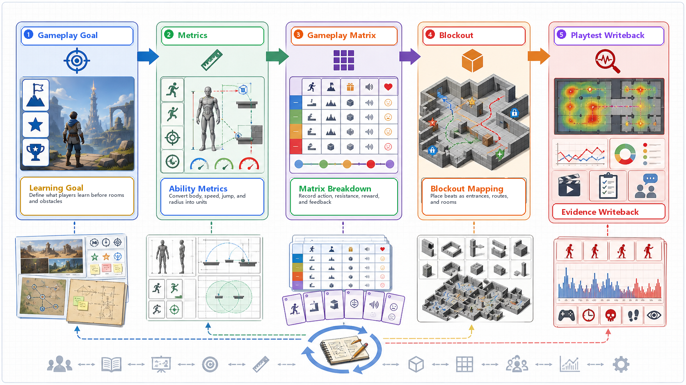

| Image elements | design description |
|---|---|
| Core gameplay/skills | Starting from the gameplay verb, connect the ruler, matrix, gray box, test and write-back |
| Player actions/operations | Observe, move, try, fail, fix, reuse |
| obstacle or enemy | Spatial misleading, inaccurate dimensions, sudden difficulty, and teaching gaps |
| rewards or resources | Reusable templates, clear review language, and testable assumptions |
| Teaching status and expected emotions | Overview; let newbies know that level design is an operational process |

## How to use this textbook

It is recommended to practice in the following order:

1. Read "Basic Concepts of Level Design" first and learn to break down levels into observable player actions.
2. Read "Metrics/Ruler" again and use grids or metrics to define character abilities and level elements.
3. Next fill out the Gameplay Matrix, making sure each paragraph has core skills, obstacles, rewards, and emotional goals.
4. Blockout the matrix and check whether the space actually supports matrices.
5. Through testing, observation, interviews and data, questions are written back into the matrix and space.

The most common problem for newbies is: drawing a map at the beginning, or piling up enemies and rewards at the beginning. A more stable approach is to first ask: "What does the player want to learn in this section? What space do I use for him to learn? How do I know he has really learned it?"

## Basic concepts of level design

### Gameplay and core loop

The gameplay is not "what's in the map", but the cycle of actions that the player performs repeatedly between rules, goals, space and feedback. The core loop of a level can usually be written as:

Observe the target -> Perform the action -> Encounter resistance -> Get feedback -> Adjust strategy -> Keep moving forward

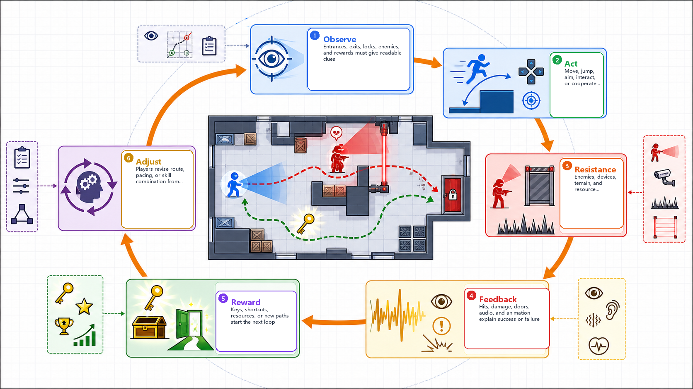

| Image elements | design description |
|---|---|
| Core gameplay/skills | Observation, action, feedback, and correction form a cycle |
| Player actions/operations | Look at the target, move, jump, aim, interact, try again |
| obstacle or enemy | distance, time, enemy, line of sight, threshold, failure penalty |
| rewards or resources | Confirm that the action is valid through feedback, such as gold coins, keys, route opening, and space progress |
| Teaching status and expected emotions | Concept establishment; let readers understand that "action loop" is more important than "content list" first |

### Basic concept table

| concept | How should novices understand | What to write when designing |
|---|---|---|
| How to play | Meaningful actions that players perform repeatedly | Core verbs such as jump, avoid, observe, reason, aim, collaborate |
| player action | Real player input and behavior | Run, jump, stop, look, aim, hide, push boxes, open doors, call teammates |
| enemies/obstacles | Resistance that forces the player to change their actions | Pit, wall, door, enemy, time limit, line of sight obstruction, incomplete information |
| Resources/Rewards | Positive feedback that guides player actions | Gold coins, keys, ammunition, lives, shortcuts, information, plot advancement |
| Rhythm | Alignment of stress and rest | Low-pressure learning, high-pressure verification, short-term release |
| difficulty | The cognitive and operational costs required for players to complete their goals | Distance, speed, quantity, combination degree, failure cost |
| emotional goals | What should the player feel during this section? | Curiosity, understanding, concentration, tension, surprise, control, relief |

### player action

Player actions must be observable. Don't just write "combat area", "puzzle area" and "platform area", write "jump 1 square pit from safe ground" "see the locked door first and then look for the key" "go around to the enemy's side to attack" "two players stand on the switch at the same time".

An action is suitable for entering the matrix, usually meeting three points:

- Observable: During testing, you can see whether the player performed this action.
- Failable: If the player can't do it, the level will reveal problems.
- Transferable: After players learn it, they can reuse it in subsequent paragraphs.

### Enemies, Obstacles and Space Resistance

Enemies aren't just a source of damage, and obstacles aren't just in the way. Their function is to change the player's actions and allow the player to learn some kind of judgment.

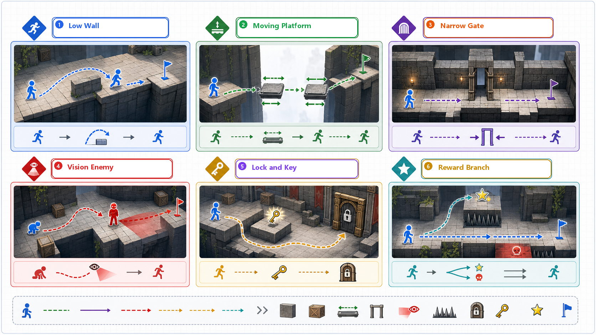

| Image elements | design description |
|---|---|
| Core gameplay/skills | The same action produces different learning goals under different obstacles |
| Player actions/operations | Jump, wait, go around, hide, observe, try again |
| obstacle or enemy | Pit, wall, moving platform, remote enemy, locked door, line of sight obstruction |
| rewards or resources | Safe landing point, key, supplies, shortcut, next entrance |
| Teaching status and expected emotions | Understand; let newbies see the "grammar of obstacles = actions" |

### Resources, pacing, difficulty and mood

Resources are not just rewards. Resources also tell players "where is worth going, when to take risks, and when to rest." Rhythm determines how these rewards and pressures are sequenced.

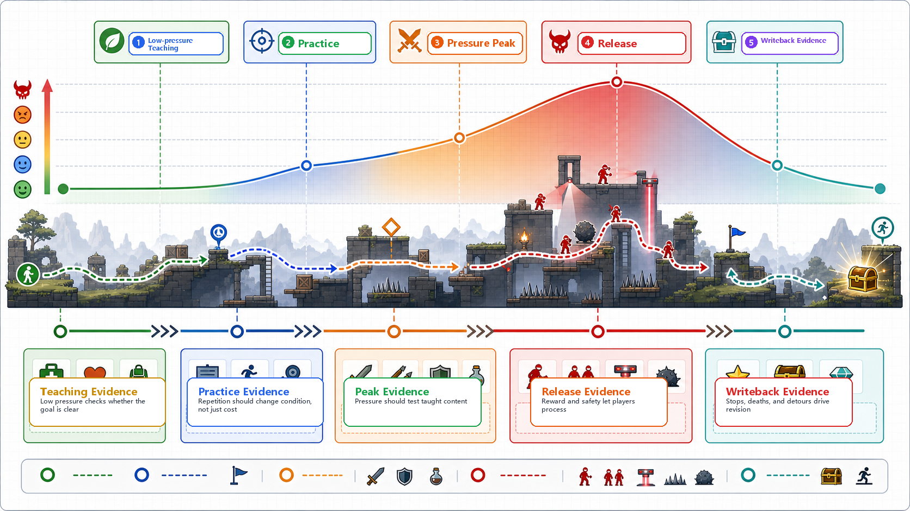

| Image elements | design description |
|---|---|
| Core gameplay/skills | Control the pressure curve of learning, practice, verification and release |
| Player actions/operations | enter, try, bear pressure, pass, organize, continue |
| obstacle or enemy | Difficulty peaks, continuous failures, information overload, insufficient resources |
| rewards or resources | Low-pressure supplies, visible targets, stage rewards, resting space |
| Teaching status and expected emotions | Rhythm management; making the levels neither tense nor boring all the time |

## Metrics / Ruler: Turn abstract ability into a drawable grid

Metrics are the most underrated tool in level design. The questions it answers are simple: How wide and tall is the character, how far can it jump, how far can it see, what is the enemy's attack range, how long should the room be, how wide should the door be?

If there is no ruler, two types of problems will occur in the level: the designer thinks it is "almost", and the players think it is "unfair"; the drawing looks reasonable, but the feel drifts after entering the game.

In this section, we need to first establish two sets of rulers: the character ability ruler answers "what the player can do", and the level element ruler answers "how the space carries gameplay". The former determines the pit width, wall height, platform distance, and skill radius; the latter determines the room volume, passage width, enemy radius, resource distance, and line of sight exposure.

### Metric/Scale Overview: Character Ability Scale + Level Element Scale

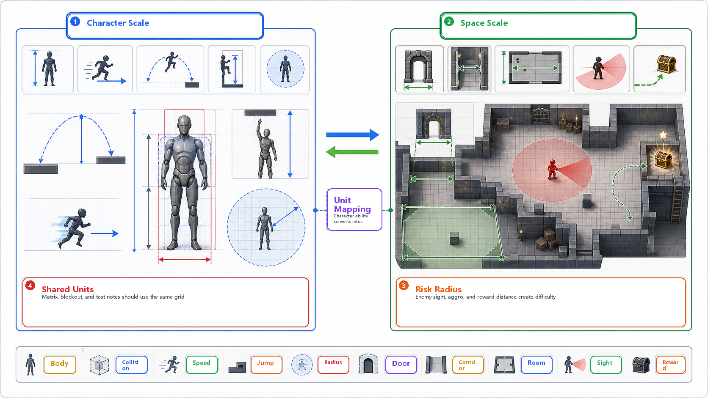

| Image elements | design description |
|---|---|
| Core gameplay/skills | Distinguish between "Character Ability Scale" and "Level Element Scale" |
| Player actions/operations | Read character collision box, jump distance, skill radius, room width |
| obstacle or enemy | The radius is too large to cover the entire room, the passage is too narrow, and the skill range does not match the space. |
| rewards or resources | Once units are identified, bonus distance, enemy range, and resource distribution can all be compared |
| Teaching status and expected emotions | Establish standards; let novices understand that all spatial decisions come back to the unit |

How to use:

| step | operate | output |
|---|---|---|
| 1 | Select base unit | 1 character width available for platform games; 1 meter or 1 tile available for 3D games |
| 2 | Record character abilities | Collision box, movement speed, jump height, horizontal jump distance, skill radius |
| 3 | Record level elements | Passage width, room size, door width, platform spacing, enemy attack range |
| 4 | alignment matrix | For each matrix cell, indicate "Which scale was used for this challenge?" |
| 5 | test writeback | When the player fails, first check whether the size exceeds the teaching range |

### Character ability scale: body, speed, jump, skill radius

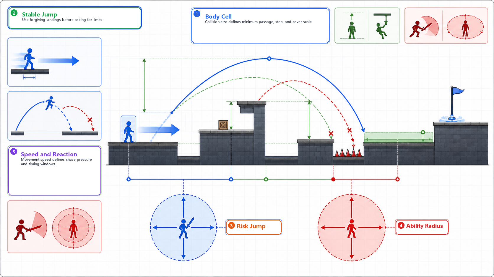

| Image elements | design description |
|---|---|
| Core gameplay/skills | Use a 7×13 screen grid to record the character’s body and mobility |
| Player actions/operations | Stand, jump horizontally, vertically jump, land, judge the limit distance |
| obstacle or enemy | Platforms that are too high, potholes that are too wide, ceilings that are too low, passages that are too narrow |
| rewards or resources | Safe landing point, teaching gold coins, main path platform, optional challenge platform |
| Teaching status and expected emotions | Introduction; let designers first grasp “what the character can do” |

The point of this picture is not to show the character "settings", but to turn what the player can do into drawable units: body size, vertical reach, horizontal stable jump, risk landing point, movement speed and skill radius must all be written back to the level matrix.

| ruler item | precise definition | Intended use |
|---|---|---|
| main character | 1×1 collision box | The basis for the width of all passages, openings and platforms |
| Screen | 7×13 grid | Determine how much information and challenges can be displayed on one screen |
| Movement speed | 4 frames/second | Estimating reaction times, chase pressure, and platform cadence |
| Vertically accessible | 3 spaces up from standing space | Determining step height, climbing instruction, and failure boundaries |
| Lateral stable jump | 3 cells | Used for main path security challenges |
| Horizontal risk zone | The 4th cell is an empty cell | Used for optional challenges or later verification, not suitable for first-time teaching |

Operation suggestion: Before drawing the first blockout, novices should copy this picture and fill in their own character abilities. Don't draw "a good-looking room" first, draw "a room that the character is sure to pass through" first.

### Level element ruler: size, difficulty, enemies, resources

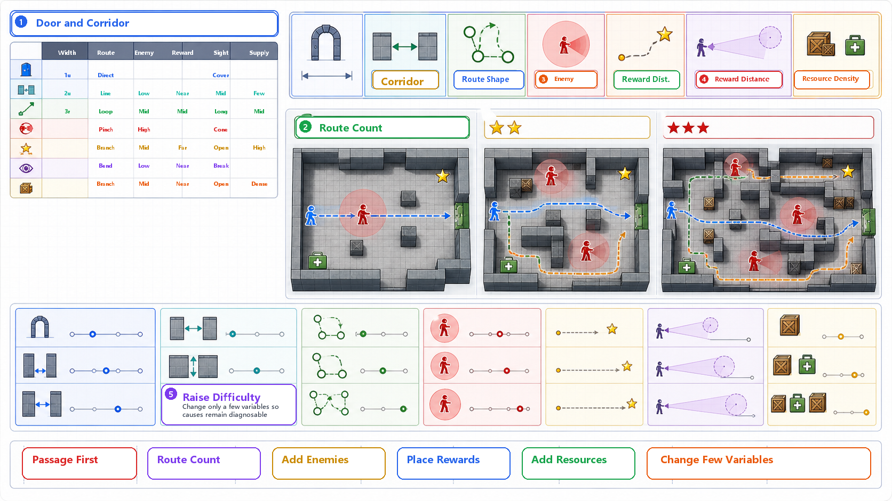

| Image elements | design description |
|---|---|
| Core gameplay/skills | Use "volume × difficulty" to estimate the time, death rate, and enemy configuration of a level segment |
| Player actions/operations | Enter the room, choose a path, deal with enemies, and reach the exit |
| obstacle or enemy | Ordinary enemies, elite enemies, boss-type enemies, and compound enemy combinations |
| rewards or resources | Room exit, stage rewards, supplies, optional high-value targets |
| Teaching status and expected emotions | Planning; let designers define volume and desired intensity before placing content |

The level element ruler puts the planning matrix and space map together. When using it, don’t treat the number as an absolute standard, but as an initial hypothesis for discussion among the team: any increase in difficulty of a block must be able to indicate on the room map whether the change is door width, passages, number of routes, enemy radius, resource distance, or line of sight exposure.

| Dimensions | How do novices fill in | Common mistakes | Correction method |
|---|---|---|---|
| volume | Small, medium, and large; corresponding to the number of rooms, number of routes, and estimated duration | Just write "big room", don't write how long the player has to walk | Use the number of cells, number of rooms, and estimated time to describe |
| difficulty | Easy, medium, hard; corresponds to mortality or number of failures | Equating more enemies with difficulty | Simultaneously record enemies, distance, line of sight, resources, and failure cost |
| Enemy type | Normal, Elite, Boss, Combination | Mixing too many enemies in the beginning | Single teaching first, then combined verification |
| Room thumbnail | Expressed in terms of path number, enemy position, and exit distance | Only draw art layout | First draw the player route and information sequence |

### Challenge Matrix Scale: Four variations of the same skill

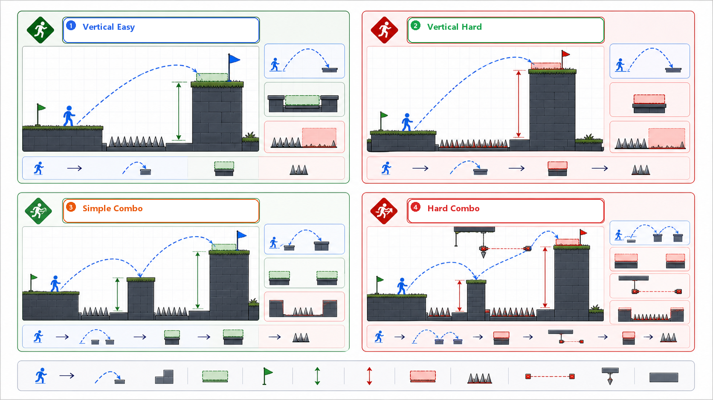

| Image elements | design description |
|---|---|
| Core gameplay/skills | Divide the same skill into four states: easy, difficult, combination, and overload. |
| Player actions/operations | Jump over low walls, jump onto high walls, cross pits and then fall to platforms, deal with high platform combinations |
| obstacle or enemy | 1-block wall, 2-block wall, 1-block pit, 3-block pit, 2 to 3-block raised platform |
| rewards or resources | Safe landing point, main road advancement, optional challenges, space to try again after failure |
| Teaching status and expected emotions | Variation; let novices see that the difficulty is not random addition, but matrix combination |

How to read the four-square challenge:

| lattice | Difficulty meaning | Where is it suitable to place in the level? | design reminder |
|---|---|---|---|
| Vertical jump: easy | Low wall or platform, only verify take-off | introductory paragraph | The price of failure is lower |
| Vertical Jump: Difficult | High wall or platform, close to the upper limit of ability | Verification section | Jump height must be taught first |
| Combo Challenge: Easy | Small pit + platform for landing | practice section or variation section | Give enough landing points so that players can review the game |
| Combo Challenge: Hard/Incomplete | Big pit + high platform, beyond the stable teaching area | Later challenges or optional routes | Don’t put this combination suddenly on the main path |

### Horizontal jump ruler: The same is a pit, the width is the difference in teaching

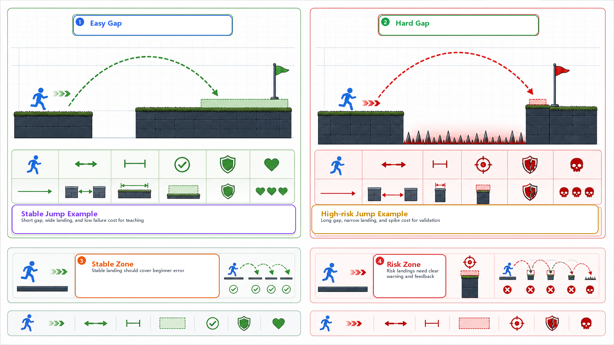

| Image elements | design description |
|---|---|
| Core gameplay/skills | Comparing 1-grid pits and 3-grid pits on how to change teaching goals |
| Player actions/operations | Take off, jump over pits, land, and judge safe distances |
| obstacle or enemy | 1-square pit, 3-square pit, insufficient landing point width, insufficient take-off space |
| rewards or resources | Passing the main road, visible landing point, and retrying the platform after failure |
| Teaching status and expected emotions | Comparison; let novices understand that "the same pitfalls, different widths mean different teachings" |

Suggested implementation rules:

| pit width | Teaching status | expected emotion | Usage suggestions |
|---|---|---|---|
| 1 grid | introduction | safety, understanding | When it appears for the first time, don’t overlay enemies next to it. |
| 2 cells | practise | focus | Slight time pressure can be added |
| 3 cells | verify | nervous | Players must master the take-off and landing points before using |
| 4 cells or more | Mastery/Optional | challenge, sense of accomplishment | Use the main path with caution and must have clear notice and recycling |

### Metrics image redraw and review requirements

When redrawing similar images later, lock the following information in the production brief and review checklist:

- White background, clear black grid, no watermark, no logo.
- All grids are of equal width and height, and players, pits, walls, and platforms must be aligned with the grid lines.
- The character ability map must retain: protagonist 1×1, screen 7×13, movement speed 4 blocks/second, vertical reach, horizontal stable jump and risk grid.
- The size difficulty map must be retained: small/medium/large size, easy/medium/hard, enemy type rows, and room thumbnails.
- The challenge matrix must retain four cells: Vertical Easy, Vertical Hard, Combination Easy, and Combination Difficulty/Incomplete.
- Horizontal jump diagrams must keep a comparison of 1-square pits and 3-square pits.

## Application of Gameplay Matrix

### The difference between Matrix and Gameplay Matrix

Matrix is ​​a table that intersects multiple dimensions; Gameplay Matrix is ​​a table that binds "what the player knows, does, encounters, gets, and feels" to the level process.

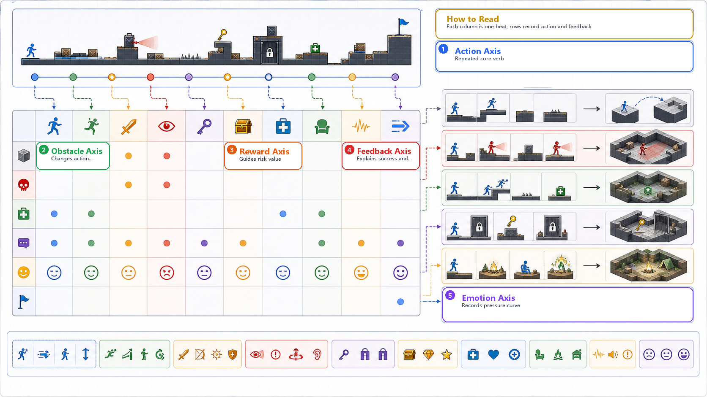

| Image elements | design description |
|---|---|
| Core gameplay/skills | Use the horizontal axis to represent the process and the vertical axis to represent the design dimension. |
| Player actions/operations | Write observable actions in each box |
| obstacle or enemy | Obstacles must serve the current skill and should not be stacked randomly. |
| rewards or resources | Rewards should reinforce correct actions or guide routes |
| Teaching status and expected emotions | Let the team see the teaching sequence, difficulty curve, and emotion curve |

### Questions that must be answered for each matrix cell

| Field | Required question | Example |
|---|---|---|
| Beat | Which teaching paragraph is this? | B01、B02、B03 |
| Core gameplay/skills | What does the player learn or verify in this space? | Short horizontal jump, watch to lock the door, sideways to dodge |
| Player actions/operations | What exactly do players do? | Run over 1 pit, see the key door, avoid the enemy's sight |
| obstacle or enemy | What forces the player to do this action? | Pit, wall, patrol enemy, lock door, countdown |
| rewards or resources | What proves that the action works? | Safe drop points, gold coins, keys, supplies, shortcuts |
| Teaching status | Introduction, practice, verification, variation, mastery, release | B01 introduction, B03 verification |
| expected emotion | What should players feel? | Curiosity, understanding, concentration, tension, relief |
| space description | How does this grid appear on the map? | Low-risk platform, wide landing point, visible exit |
| Test hypothesis | How do you want players to behave? | 80% of players pass the first time |

### Teaching status dictionary

| state | Purpose | spatial features | Common mistakes |
|---|---|---|---|
| introduction | Show skills for the first time | Safe, single, visible, low penalty | Stack enemies and time pressure as soon as they appear |
| practise | Allow players to repeat success | Small changes, clear feedback | Repeated for too long, no new information |
| verify | Make sure players actually learn it | Add risk or cost of failure | Take the test without being taught |
| variation | change context | Same skills, different spaces or enemies | Transform into new skills |
| proficient | Combine multiple learned skills | High voltage but readable | Rely only on reaction, not review |
| release | Let players organize their experience | Low pressure, supply, export, display results | Enter new high pressure immediately after the peak |

## Teaching Matrix Example

The following example is not for you to copy, but to show how the matrix can be synchronized with space. Each example can be replaced with character abilities, enemies, and resources from your project.

### Example 1: Platform action basic jump five steps

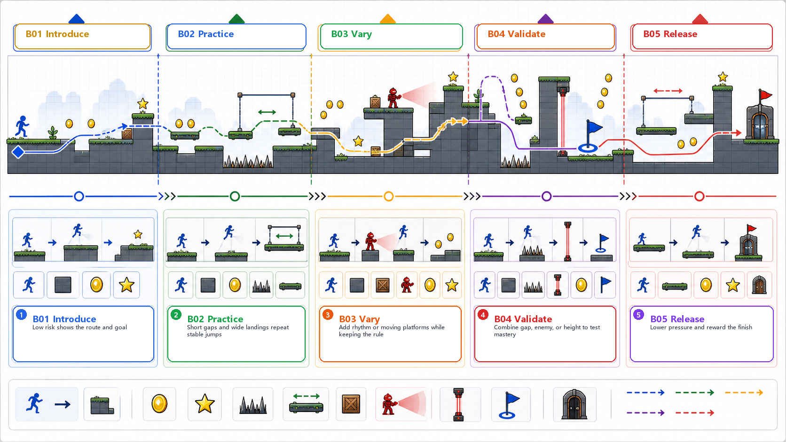

| Image elements | design description |
|---|---|
| Core gameplay/skills | Transitioning from low-risk moves to leap verification |
| Player actions/operations | Run, jump, land, try again |
| obstacle or enemy | Low walls, 1-cell pit, moving obstacles, combined platforms |
| rewards or resources | Route gold coins, safe landing points, and end point rewards |
| Teaching status and expected emotions | Introduction to release; allowing players to gradually build a sense of control |

| Beat | Core gameplay/skills | Player actions/operations | obstacle or enemy | rewards or resources | Teaching status | expected emotion | space description |
|---|---|---|---|---|---|---|---|
| B01 | basic movement | Run to visible target | Flat ground and low platform | Route coins | introduction | curious | Wide platform, no failure penalty |
| B02 | 1 short jump | Jump over the pit | 1 grid pit | safe landing point | introduction | understand | There is room for standing before and after the pit. |
| B03 | Continuous short jumps | Control the take-off rhythm | Two 1-square pits | gold coin line | practise | focus | Fixed spacing between pits |
| B04 | 3 grid verification jump | Jump over a wide pit after a run-up | 3 grid pit | Path to pass | verify | nervous | Only verify jump distance, do not stack enemies |
| B05 | release segment | Run to the exit easily | low pressure disorder | Finishing reward | release | relieved | Arrange the rhythm for players |

#### Synchronized Space Sketch

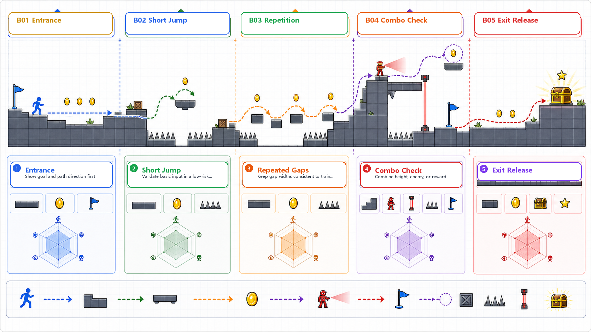

| Image elements | design description |
|---|---|
| Core gameplay/skills | Drop the five-segment matrix into the horizontal space |
| Player actions/operations | It goes through movement, short jump, continuous jump, verification jump, and exit in sequence. |
| obstacle or enemy | The pit width gradually increases and the combination degree gradually increases |
| rewards or resources | Gold coin lines and exits remind players of the correct route |
| Teaching status and expected emotions | The matrix is ​​synchronized with space; allowing the reader to see the position of each beat |

### Example 2: "Observation -> Action -> Feedback" matrix for a puzzle level

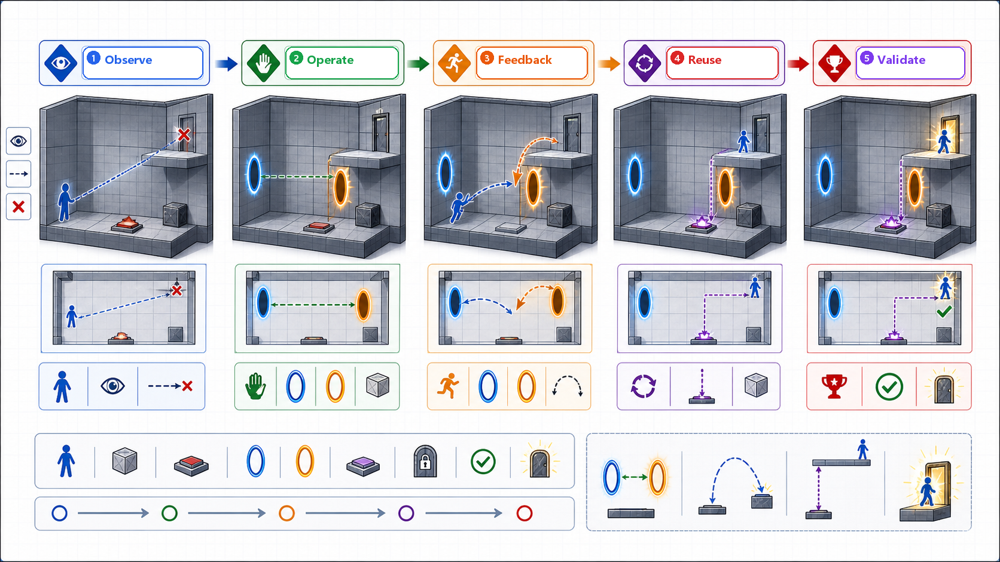

| Image elements | design description |
|---|---|
| Core gameplay/skills | Observe the rules first, then operate the mechanisms, and then use feedback to advance |
| Player actions/operations | Look at the target, trigger the mechanism, compare changes, and operate again |
| obstacle or enemy | Information blocking, one-way door, timing mechanism, wrong path |
| rewards or resources | Open doors, bridges, visible exits, shortcuts |
| Teaching status and expected emotions | From confusion to understanding; making players feel "I figured it out" |

| Beat | Core gameplay/skills | Player actions/operations | obstacle or enemy | rewards or resources | Teaching status | expected emotion | space description |
|---|---|---|---|---|---|---|---|
| B01 | Observation target | Saw the exit but couldn't get there | Transparent wall/high platform | target preview | introduction | curious | The exit is visible first |
| B02 | Operating mechanism | press switch | single switch | door opens briefly | introduction | understand | The mechanism and the door are in the same line of sight |
| B03 | Feedback comparison | Observe door switch status | Timing restrictions | safe retry | practise | focus | There is no penalty for failure, only reset |
| B04 | Rule migration | Reuse mechanism in new location | Corner or occlusion | new route | verify | Achievement | Same rules, different spaces |
| B05 | release | Go to the exit | none | Export incentives | release | relieved | Show players have mastered the rules |

#### Synchronized Space Sketch

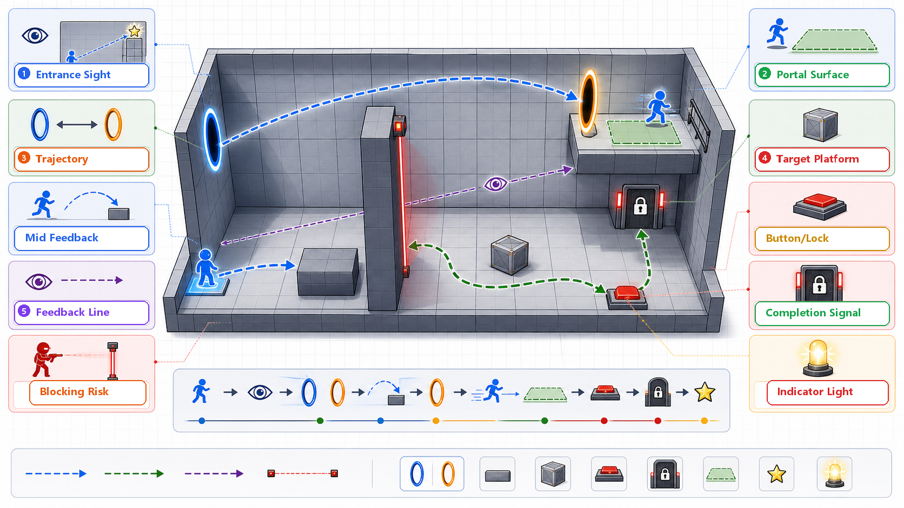

| Image elements | design description |
|---|---|
| Core gameplay/skills | Put observation, mechanism, feedback and exit into the same spatial relationship |
| Player actions/operations | Enter the room, look at the exit, press the button, return to observe, pass |
| obstacle or enemy | Blocking paths, timing gates, line of sight occlusion |
| rewards or resources | Visible exit, open path, success feedback |
| Teaching status and expected emotions | Spatial reasoning; allows players to understand rules through layout |

### Example 3: Rhythm Matrix for Shooting Encounters

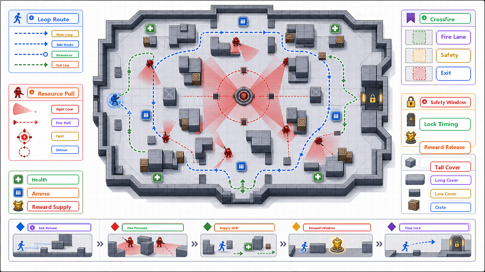

| Image elements | design description |
|---|---|
| Core gameplay/skills | Moving shooting, position transposition, priority judgment |
| Player actions/operations | Enter, find cover, clear mobs, deal with elites, supply, exit |
| obstacle or enemy | Melee enemies, long-range enemies, flanking routes, resource pressure |
| rewards or resources | Ammunition, Lives, Temporary Safe Zone, Exit |
| Teaching status and expected emotions | High-pressure verification; making pressure readable and replayable |

| Beat | Core gameplay/skills | Player actions/operations | obstacle or enemy | rewards or resources | Teaching status | expected emotion | space description |
|---|---|---|---|---|---|---|---|
| B01 | Entrance reading room | Quick observation after entering | Few low threat enemies | Ammunition tips | introduction | vigilance | First sight of the bunker and the direction of the exit |
| B02 | mobile shooting | Attack while moving | Melee enemies approaching | life supply | practise | focus | Central space allows for circles |
| B03 | Priority judgment | Deal with high-threat targets first | Remote enemies occupy high ground | high point route | verify | nervous | High threat enemies must be readable |
| B04 | Resource pressure | Risking supplies | flanking enemy | ammo/health | variation | greed and vigilance | Supply points cannot be safe without thinking |
| B05 | Clearance and release | Check remaining enemies and exits | sporadic enemies | exit | release | relieved | The rhythm has dropped and review is allowed |

### Example 4: Cooperation and multi-role matrix

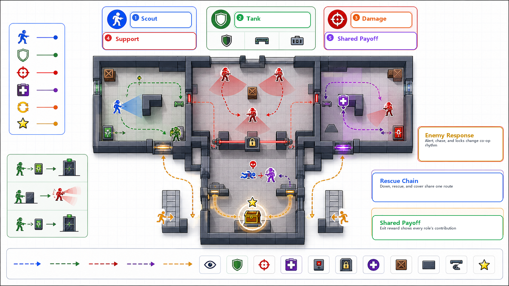

| Image elements | design description |
|---|---|
| Core gameplay/skills | Clearly describe role capabilities, responsibilities and synchronization points |
| Player actions/operations | Call, confirm, division of labor, synchronous execution |
| obstacle or enemy | Information asymmetry, time limit, two-person switch, separation route |
| rewards or resources | Shared shortcuts, double doors, team progress |
| Teaching status and expected emotions | Trust; Make Cooperation Not Two Single Player Levels Side by Side |

| Beat | Core gameplay/skills | Player actions/operations | obstacle or enemy | rewards or resources | Teaching status | expected emotion | space description |
|---|---|---|---|---|---|---|---|
| B01 | role identification | Use each ability once | Small obstacles that can be solved by one person | shared path | introduction | clear | Both players can see the results |
| B02 | information communication | One person observes, one person executes | information asymmetry | safe passage | practise | trust | Observer perspective must be useful |
| B03 | Synchronous execution | Simultaneous operation after countdown | Double switch | open the door | verify | nervous | Failure only resets, no long-term penalty |
| B04 | role variations | exchange dominance | split route | shortcut | variation | Fresh | Don't leave a player with nothing to do for a long time |
| B05 | co-release | Meet at the exit | none | Shared rewards | release | relieved | Meeting points showcase contributions from both sides |

## Process and iteration

### Concept -> Process -> Space -> Test -> Iteration

Level design is not written all at once, but turns from hypothesis to experience.

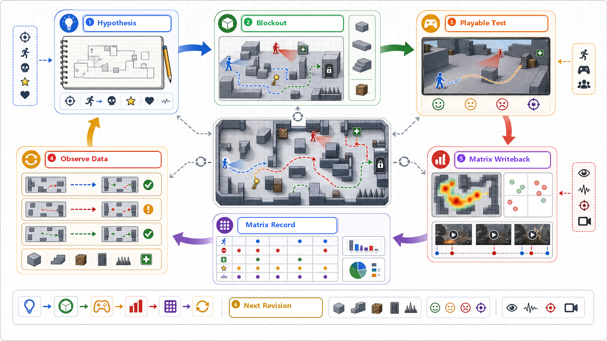

| Image elements | design description |
|---|---|
| Core gameplay/skills | From concept to matrix to space, testing and writing back |
| Player actions/operations | Designers fill in, build, observe, and modify |
| obstacle or enemy | The hypothesis is unclear, the space does not support it, and the test evidence is insufficient. |
| rewards or resources | Reusable processes and clear correction directions |
| Teaching status and expected emotions | Methodology; let novices know what is produced at each step |

| stage | key questions | output | Common inspections |
|---|---|---|---|
| concept | What does this teach? | Sentence target, core verb | Is there only one main skill? |
| process | What to teach first and what to test later? | Gameplay Matrix | Is it possible to take exams without teaching? |
| space | Where does this skill occur? | Blockout | Can the target be read from the entrance? |
| test | Are players acting as expected? | Observation records, data, interviews | Can it be replayed if it fails? |
| Iterate | Change the matrix, space, enemies or rewards? | Revised matrix and gray box | Has it only changed the appearance but not the reason? |

### From matrix to blockout

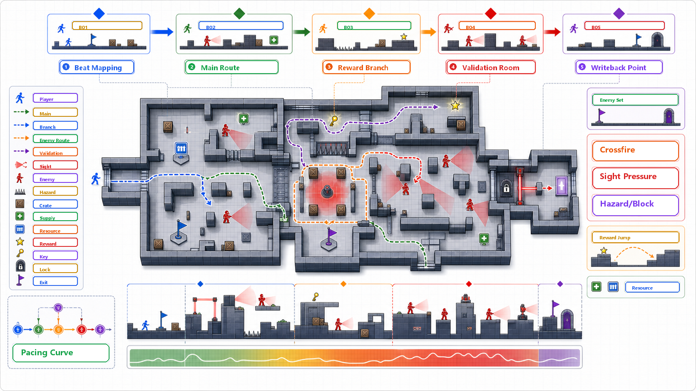

| Image elements | design description |
|---|---|
| Core gameplay/skills | Convert matrix beats into space nodes |
| Player actions/operations | Entrance observation, main road advancement, branch road selection, verification, exit release |
| obstacle or enemy | Locked doors, pits, enemies, line of sight obstruction, bifurcation |
| rewards or resources | Main road rewards, side road rewards, supplies, shortcuts |
| Teaching status and expected emotions | Implementation; allowing designers to enter the space from the table |

Blockout Checklist:

| Check items | pass standard |
|---|---|
| Whether the entry can read the target | Players can understand the direction or short-term goals within 3 seconds of entry |
| Whether each beat has a spatial position | There are no "dangling" cells in the matrix |
| Whether the barrier serves the current skill | Do not stack multiple new skills on the same grid |
| Do rewards reinforce correct actions? | Reward locations point to target behaviors rather than misleading players |
| Can it be resumed after failure? | Players know where they went wrong instead of feeling cheated |

## Quantization and writeback

### How design assumptions become validation metrics

The matrix does not end when it is written. Each cell should be able to be turned into a test hypothesis.

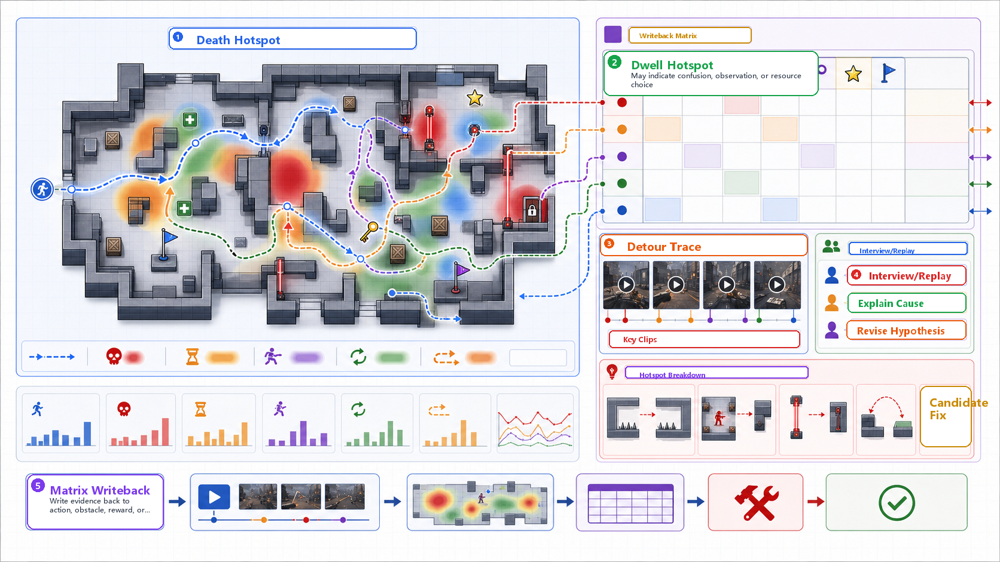

| Image elements | design description |
|---|---|
| Core gameplay/skills | Write the test evidence back into the matrix grid |
| Player actions/operations | Death, stay, repeated failure, detour, giving up, success |
| obstacle or enemy | The size is too difficult, the target is unreadable, the enemy pressure is too strong, and the rewards are misleading. |
| rewards or resources | Data, observations, interviews, corrective actions |
| Teaching status and expected emotions | Verification; moving the design from "I think" to "Evidence shows" |

| matrix lattice | design assumptions | Observations/Data | Interview questions | write back action |
|---|---|---|---|---|
| B02: 1 frame short jump | 80% of new players pass on the first try | First time success rate, pause time | "You know how to jump over there?" | If you can’t understand, add gold coin lines or lens tips. |
| B04: 3 grid verification jump | Players have mastered the run-up jump | Number of deaths and distribution of jumping locations | “What do you think was the reason when you failed?” | If you know but can’t do it, relax your focus; if you don’t know, go back to teaching. |
| Puzzle B03: Mechanism Feedback | Players understand how buttons affect doors | Return observation rate, number of repeated attempts | "What do you think the button changed?" | If you don’t see feedback, adjust the sight and sound effects |
| Shooting B03: High Threat Target | Players can identify priority targets | Damage source, killing order | "Which enemy did you notice first?" | Change enemy position or entry prompt if unreadable |

### Division of labor among data, interviews and observations

| method | What can I answer? | Can't answer anything | Where is the best place to write back? |
|---|---|---|---|
| telemetry data | Where to die, where to stop, where to take a detour | Why do players do this? | Difficulty, space, resource location |
| On-site observation | Where do players look, how long do they hesitate, and what do they do first? | Player’s inner explanation | Player actions, target readability |
| Interview | How players understand failure and goals | Large sample trend | Emotion, reason for misunderstanding, clarity of prompts |
| Video review | Behavior sequence and actions before failure | Lots of statistics | Rhythm, spatial reading, teaching status |

### Write back principle

| Discover | Don't do it in a hurry | Ask first | Possible fixes |
|---|---|---|---|
| high mortality rate | Directly weaken all obstacles | Don't you know how to do it, or you don't understand? | Relax the ruler, supplement teaching, and adjust the entrance sight line |
| Player detour | Close the branch | Are branch roads more readable than main roads? | Strengthen main road objectives and reduce misdirection rewards |
| Players did not receive rewards | Increase reward value | Do players see the reward and understand the value? | Change position, change comparison, change feedback |
| Players say it's "unfair" | Just lower the difficulty | Can it be replayed if it fails? | Advance notice, reduce hidden penalties, and increase retry space |

## Can be expanded to different types of games

Matrix methods are not specific to any type. Different types simply replace core verbs, scale units, obstacle forms, and verification indicators.

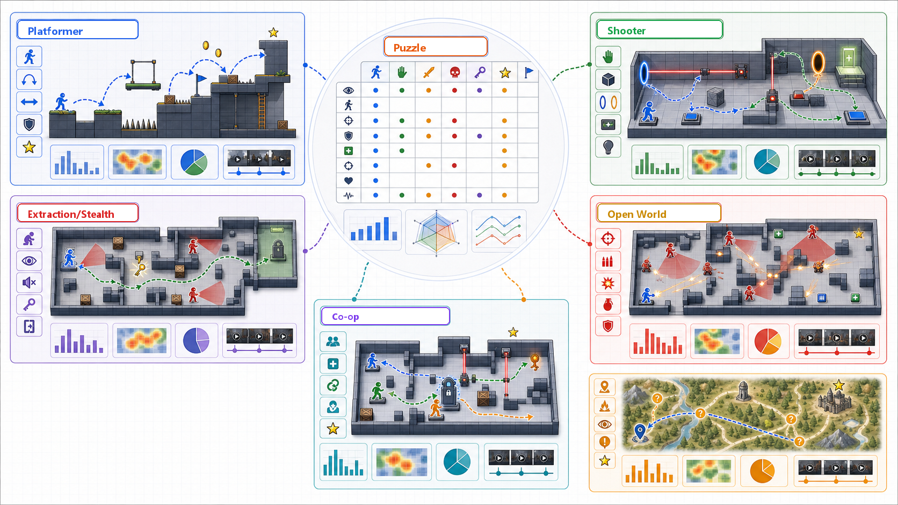

| Image elements | design description |
|---|---|
| Core gameplay/skills | The same matrix method adapts to different types |
| Player actions/operations | Replaced with jumping, reasoning, aiming, stealth, cooperation according to type |
| obstacle or enemy | Replaced by pit, lock, enemy, line of sight, time limit based on type |
| rewards or resources | Gold coins, keys, ammunition, information, plot advancement, shortcuts |
| Teaching status and expected emotions | Scalable; lets teams discuss different levels using the same language |

| type | core skill axis | Commonly used rulers | Common pitfalls |
|---|---|---|---|
| platform action | Jump, landing point, rhythm | Grid, character width, jump distance | The pit width approaches the upper limit too early |
| Solve puzzles | Rule understanding, causal feedback | Room module, line of sight, interaction distance | Players cannot see feedback |
| shooting | Aim, move, prioritize | Line of sight length, bunker distance, enemy range | High threat enemies are unreadable |
| sneak | Observation, Detour, Timing | View cone, patrol period, cover distance | Failure reason is not visible |
| cooperate | Division of labor, communication, synchronization | Player distance, line of sight sharing, countdown | A player has nothing to do for a long time |
| Multiple roles | Ability switching, complementary solutions | Role ability range, switching cost | Character abilities have no unique purpose |

## Common design pitfalls and correction strategies

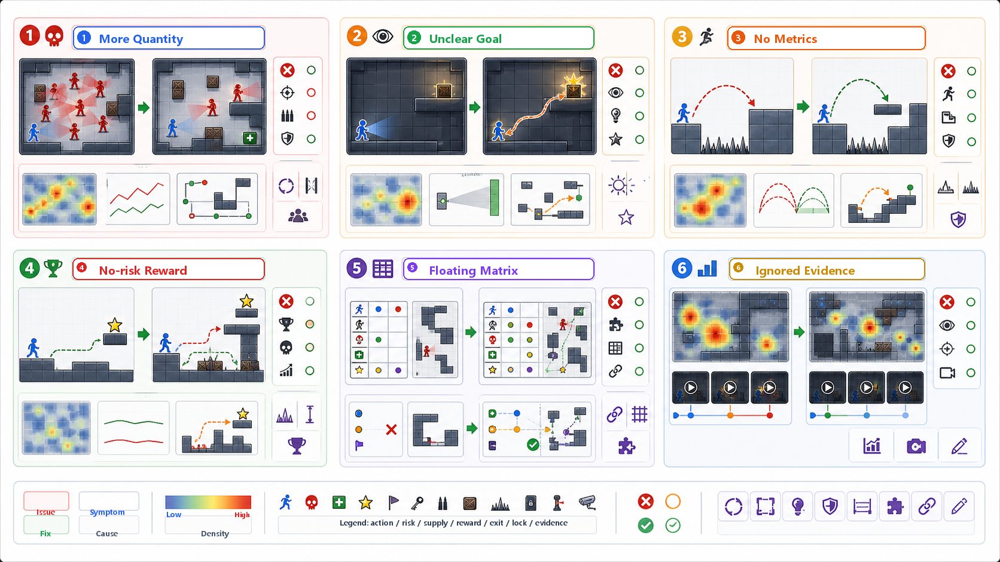

| Image elements | design description |
|---|---|
| Core gameplay/skills | Identify common problems in matrices, spaces, and testing |
| Player actions/operations | Misreading, pauses, failed repetitions, skipped content |
| obstacle or enemy | Teaching gaps, sudden changes in difficulty, unreadable objectives, and misleading resources |
| rewards or resources | Correction strategies, verification indicators, and retest results |
| Teaching status and expected emotions | Review; let novices know how to usually fix the problem |

| trap | Performance | root cause | Correction strategy |
|---|---|---|---|
| Take the test without teaching | The player dies after seeing the mechanism for the first time | Teaching status missing | Add low voltage introduction grid |
| Just add quantity without design | More enemies but a messier experience | Single difficulty dimension | Change enemy position, line of sight, rhythm and resources |
| ruler drift | Sometimes I can pass the same jump and sometimes I can't. | The pit width, wall height, and collision box are not unified. | Return to the Metrics graph and redraw it using grid numbers |
| reward misleading | Players always go the wrong way | The reward location is more visible than the target | Adjust reward tiers and sight priority |
| emotional rupture | High pressure immediately followed by high pressure again | Missing release segment | Add low-pressure space, supplies or display results |
| Only look at the data and not the video | Know where it failed, don’t know why | Missing behavioral context | Binding data, observations and interviews |
| Treat the matrix as truth | The table is neat but the levels are not fun | Tools substitute for experience judgment | Let the matrix record evidence and not replace trial play |

## Team collaboration CSV template

The companion CSV file is located at:

`关卡设计矩阵模板.csv`

It is recommended to import it into Excel, Google Sheets, Airtable or a project management tool. The meaning of the fields is as follows:

| Field | use |
|---|---|
| Record_Type | `Progression` represents the design process grid, `Validation` represents the test write-back grid |
| Level_ID | Level or room number |
| Beat_ID | Node number must correspond to blockout |
| Diagram_ID | Corresponds to the local diagram slug |
| Core_Play_Skill | Core gameplay/skills |
| Player_Action | Player actions/operations |
| Enemy_Obstacle | obstacle or enemy |
| Reward_Resource | rewards or resources |
| Teaching_State | Introduction, practice, verification, variation, mastery, release |
| Expected_Emotion | expected emotion |
| Space_Note | Spatial description, such as line of sight, landing point, cover, entrance |
| Hypothesis | design assumptions |
| Metric | Validation indicators |
| Target | target value |
| Observed | Actual value |
| Player_Quote | Excerpts from interviews or observations |
| Revision_Action | Corrective actions after writeback |
| Owner | person in charge |
| Status | Open、Testing、Fixed、Verified |

### CSV sample snippet

```csv
Record_Type,Level_ID,Beat_ID,Diagram_ID,Core_Play_Skill,Player_Action,Enemy_Obstacle,Reward_Resource,Teaching_State,Expected_Emotion,Space_Note,Hypothesis,Metric,Target,Observed,Player_Quote,Revision_Action,Owner,Status
Progression,L01,B01,character_ability_metrics_grid,Body Metrics,Stand+Move,LowCeiling+NarrowPassage,ReadableCollision,Introduce,Clarity,1x1 body grid,Designers can size passages from body metrics,Collision_Confusion_Count,0,,,"",LD,Open
Progression,L01,B02,horizontal_jump_metrics_comparison,One Tile Gap,Run+Jump+Land,OneGridGap,MainPathProgress,Introduce,Confidence,Safe landing before and after gap,New players can pass the first gap,First_Try_SuccessRate,>=85%,,,"",LD,Open
Validation,L01,B04,horizontal_jump_metrics_comparison,Three Tile Gap,Run+Jump+Land,ThreeGridGap,NextRoomAccess,Validate,Tension,Wide gap after short jump practice,Players understand the gap but must execute cleanly,Deaths_Before_Success,<=3,6,"我知道要跳，但落点太窄",Widen first landing and move challenge to later beat,LD,Testing
```

## Practical exercises

### Exercise 1: Rewrite a room as a matrix

Choose a level room that you are familiar with. Don’t draw a map first, just fill in five beats:

| Beat | Core gameplay/skills | Player actions/operations | obstacle or enemy | rewards or resources | Teaching status | expected emotion |
|---|---|---|---|---|---|---|
| B01 |    |    |    |    | introduction |    |
| B02 |    |    |    |    | practise |    |
| B03 |    |    |    |    | verify |    |
| B04 |    |    |    |    | variation |    |
| B05 |    |    |    |    | release |    |

Check three things: Are there beats testing skills the player hasn’t learned yet? Are there beats that only have rewards but no actions? Are there beats that don't have emotional goals?

### Exercise 2: Blockout the matrix

Mark the five beats from Exercise 1 on the gray box plot. Each beat is marked with at least the entrance, exit, first sight target, obstacle location, reward location, and failed recovery route.

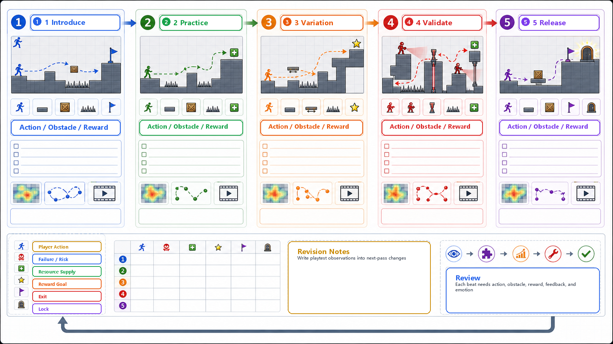

| Image elements | design description |
|---|---|
| Core gameplay/skills | Convert a five-segment matrix into a spatial sketch |
| Player actions/operations | From the entrance, it goes through introduction, practice, verification, variation, and release. |
| obstacle or enemy | Each paragraph only assumes one main teaching function |
| rewards or resources | Use rewards to reinforce correct routes and correct actions |
| Teaching status and expected emotions | Let designers practice synchronous display of matrix and space |

### Exercise 3: Write a test write-back

Select the riskiest cell in the matrix and write:

- Design Assumptions: How should players understand this?
- Observation points: What behaviors are looked at during testing?
- Metrics: What values ​​are recorded?
- Interview: What to ask players?
- Write back: If it doesn’t meet expectations, should you change the matrix, space, enemies or rewards first?

## Conclusion

The value of level design tools is that they allow the team to clearly discuss the experience: what the player wants to learn, where to learn it, how to verify it, and how to fix it.

When Metrics defines the scale, Gameplay Matrix defines the teaching sequence, Blockout carries the spatial relationship, and test write-back provides evidence, level design is no longer just "arranging content based on feeling", but becomes a set of professional methods that can be trained, reviewed, and iterated.

## Sources And Image Notes

This is a methodology textbook. Its main evidence comes from level design workflow, blockout review, playtest observation, and team review practice, rather than from a single game screenshot.

All figures in the text use local previewable assets. They help readers understand the relationship between matrices, metrics, blockouts, and test write-back; they are not meant to be read as exact engineering drawings. For grid spacing, jump distance, wall height, room volume, enemy radius, or skill range, use the written metrics, in-figure labels, and the 40px reference grid.

The repository also includes `关卡设计矩阵模板.csv`, which readers can adapt by replacing the core skill, obstacle, reward, spatial note, and test metric fields for their own projects.
