# Game Level Design Toolkit：Gameplay Matrix、Metrics、Blockout 与空间迭代

> 一句话：把“凭感觉摆关卡”变成可画图、可测试、可复盘的关卡设计工具包。
>
> 适合谁：关卡设计师、独立游戏开发者、技术策划、战斗策划、游戏设计学生。
>
> 为什么值得收藏：这里有完整教材、22 张本地示意图、Metrics / Gameplay Matrix / Blockout 工作流和可直接改用的 CSV 模板。

面向初学者与中级关卡设计师的内部培训文档。本文的目标不是罗列名词，而是教会设计师把“玩法目标、玩家动作、障碍、奖励、节奏、难度与情绪”写成可讨论、可画图、可测试、可迭代的设计工具。

本文重点使用三类工具：

- **Metrics / 标尺**：把角色能力、空间尺寸、敌人范围、资源距离转成可画的格子或米制单位。
- **Gameplay Matrix / 教学矩阵**：把每个关卡段落的核心技能、玩家动作、障碍、奖励和情绪写清楚。
- **Blockout / 灰盒图**：把矩阵里的每一格落到空间上，并通过测试数据回写。

读图提示：正文图片是为了帮助读者更快理解矩阵、标尺和灰盒之间的关系。阅读时先看图号、标题和箭头顺序，再回到正文判断它在解释哪个设计问题。图里的格子和图标负责建立尺度感与案例感；如果涉及跳距、墙高、房间体量或技能半径等精确判断，以正文指标、图中标注和文末说明为准。

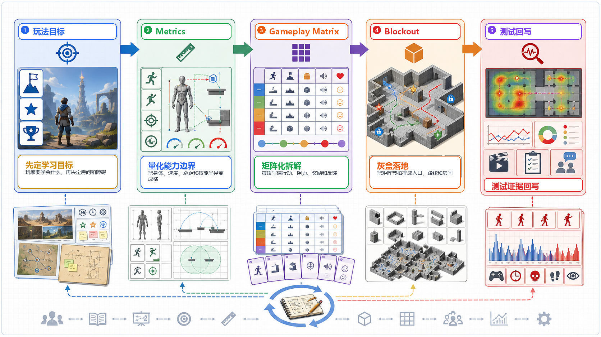

| 图像要素 | 设计说明 |
|---|---|
| 核心玩法/技能 | 从玩法动词出发，连接标尺、矩阵、灰盒、测试与回写 |
| 玩家动作/操作 | 观察、移动、尝试、失败、修正、复用 |
| 障碍或敌人 | 空间误导、尺寸不准、难度突变、教学缺口 |
| 奖励或资源 | 可复用模板、清晰评审语言、可验证假设 |
| 教学状态与期望情绪 | 总览；让新手知道关卡设计是一套可操作流程 |

## 如何使用这份教材

建议按以下顺序练习：

1. 先读“关卡设计基础概念”，学会把关卡拆成可观察的玩家动作。
2. 再读“Metrics / 标尺”，用格子或米制定义角色能力与关卡元素。
3. 接着填写“Gameplay Matrix”，确保每个段落都有核心技能、障碍、奖励和情绪目标。
4. 把矩阵落成 blockout，检查空间是否真的支持矩阵。
5. 通过测试、观察、访谈和数据，把问题回写到矩阵与空间。

新手最常见的问题是：一开始就画地图，或者一开始就堆敌人与奖励。更稳的做法是先问：“玩家在这一段要学会什么？我用什么空间让他学会？我怎么知道他真的学会了？”

## 关卡设计基础概念

### 玩法与核心循环

玩法不是“地图里有什么”，而是玩家在规则、目标、空间和反馈之间反复执行的动作循环。一个关卡的核心循环通常可以写成：

观察目标 -> 执行动作 -> 遭遇阻力 -> 获得反馈 -> 调整策略 -> 继续前进

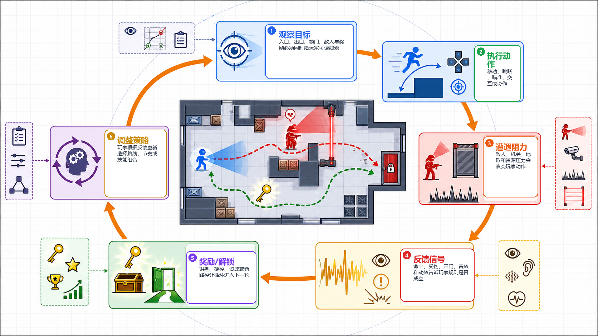

| 图像要素 | 设计说明 |
|---|---|
| 核心玩法/技能 | 观察、行动、反馈、修正形成循环 |
| 玩家动作/操作 | 看目标、移动、跳跃、瞄准、交互、再次尝试 |
| 障碍或敌人 | 距离、时间、敌人、视线、门槛、失败惩罚 |
| 奖励或资源 | 通过反馈确认动作有效，例如金币、钥匙、路线开启、空间进展 |
| 教学状态与期望情绪 | 概念建立；让读者先理解“动作循环”比“内容清单”更重要 |

### 基础概念表

| 概念 | 新手应该怎么理解 | 设计时要写成什么 |
|---|---|---|
| 玩法 | 玩家反复做的有意义动作 | 核心动词，例如跳跃、躲避、观察、推理、瞄准、协作 |
| 玩家动作 | 玩家真实输入与行为 | 跑、跳、停、看、瞄、躲、推箱、开门、呼叫队友 |
| 敌人/障碍 | 迫使玩家改变动作的阻力 | 坑、墙、门、敌人、时间限制、视线遮挡、信息不完整 |
| 资源/奖励 | 引导玩家行动的正反馈 | 金币、钥匙、弹药、生命、捷径、信息、剧情推进 |
| 节奏 | 压力与休息的排列 | 低压学习、高压验证、短暂释放 |
| 难度 | 玩家完成目标所需的认知与操作成本 | 距离、速度、数量、组合度、失败代价 |
| 情感目标 | 玩家在这一段应该感到什么 | 好奇、理解、专注、紧张、惊喜、掌控、释然 |

### 玩家动作

玩家动作必须可观察。不要只写“战斗区”“解谜区”“平台区”，要写“从安全地面跳过 1 格坑”“先看到锁门再寻找钥匙”“绕到敌人侧面攻击”“两名玩家同时站上开关”。

一个动作适合进入矩阵，通常满足三点：

- 可观察：测试时能看见玩家是否做了这个动作。
- 可失败：如果玩家不会做，关卡会暴露问题。
- 可迁移：玩家学会后，可以在后续段落复用。

### 敌人、障碍与空间阻力

敌人不只是伤害来源，障碍也不只是挡路。它们的作用是改变玩家动作，让玩家学会某种判断。

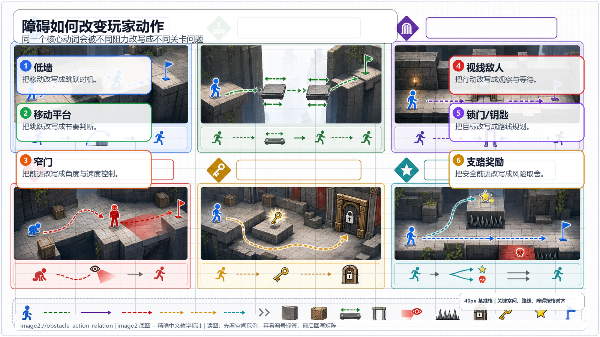

| 图像要素 | 设计说明 |
|---|---|
| 核心玩法/技能 | 同一个动作在不同障碍下产生不同学习目标 |
| 玩家动作/操作 | 跳、等、绕、躲、观察、二次尝试 |
| 障碍或敌人 | 坑、墙、移动平台、远程敌人、锁门、视线遮挡 |
| 奖励或资源 | 安全落点、钥匙、补给、捷径、下一段入口 |
| 教学状态与期望情绪 | 理解；让新手看到“障碍=动作的语法” |

### 资源、节奏、难度与情绪

资源不是单纯奖励，资源还会告诉玩家“哪里值得去、什么时候该冒险、什么时候该休息”。节奏则决定这些奖励和压力如何排列。

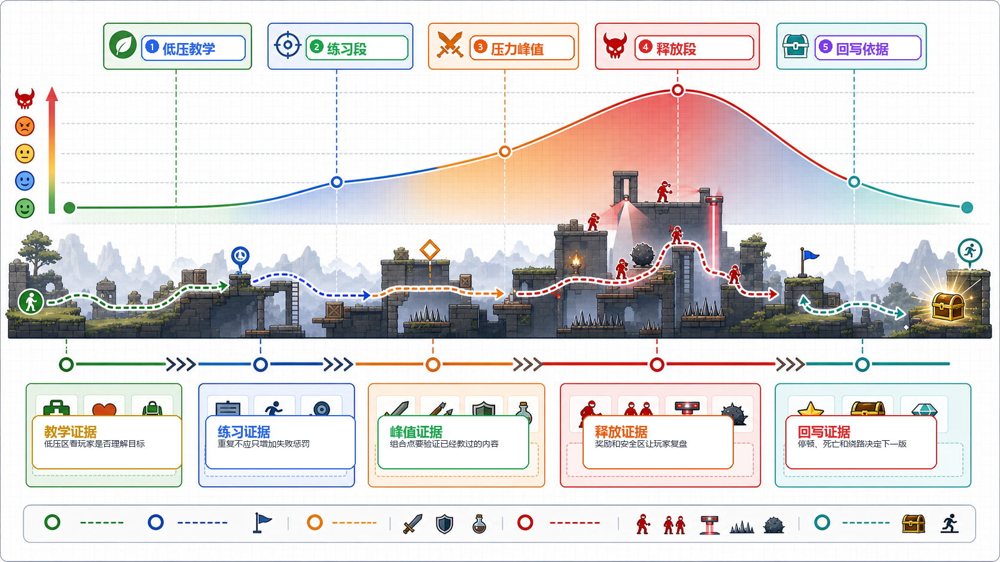

| 图像要素 | 设计说明 |
|---|---|
| 核心玩法/技能 | 控制学习、练习、验证、释放的压力曲线 |
| 玩家动作/操作 | 进入、尝试、承压、通过、整理、继续 |
| 障碍或敌人 | 难度峰值、连续失败、信息过载、资源不足 |
| 奖励或资源 | 低压补给、可见目标、阶段奖励、休息空间 |
| 教学状态与期望情绪 | 节奏管理；让关卡不是一直紧张，也不是一直无聊 |

## Metrics / 标尺：把抽象能力变成可画的格子

Metrics 是关卡设计里最容易被低估的工具。它回答的问题很朴素：角色到底多宽、多高、能跳多远、能看多远、敌人攻击范围多大、房间应该多长、门应该多宽？

如果没有标尺，关卡会出现两类问题：设计师以为“差不多”，玩家觉得“不公平”；图纸看起来合理，进游戏后手感漂移。

本节要先建立两套尺标：角色能力尺标回答“玩家能做到什么”，关卡元素尺标回答“空间如何承载玩法”。前者决定坑宽、墙高、平台距离、技能半径；后者决定房间体量、通道宽度、敌人半径、资源距离和视线暴露。

### 米制/标尺总览：角色能力尺标 + 关卡元素尺标

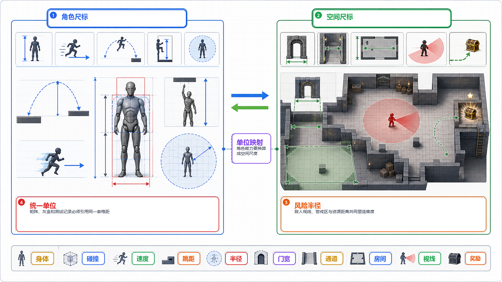

| 图像要素 | 设计说明 |
|---|---|
| 核心玩法/技能 | 区分“角色能力标尺”和“关卡元素标尺” |
| 玩家动作/操作 | 读取角色碰撞盒、跳跃距离、技能半径、房间宽度 |
| 障碍或敌人 | 半径过大覆盖全房间、通道过窄、技能范围与空间不匹配 |
| 奖励或资源 | 明确单位后，奖励距离、敌人范围和资源分布都能被比较 |
| 教学状态与期望情绪 | 建立标准；让新手理解所有空间决策都要回到单位 |

使用方法：

| 步骤 | 操作 | 输出 |
|---|---|---|
| 1 | 选择基础单位 | 平台游戏可用 1 个角色宽度；3D 游戏可用 1 米或 1 个地砖 |
| 2 | 记录角色能力 | 碰撞盒、移动速度、跳跃高度、横跳距离、技能半径 |
| 3 | 记录关卡元素 | 通道宽度、房间尺寸、门宽、平台间距、敌人攻击范围 |
| 4 | 对齐矩阵 | 每个矩阵格写明“这个挑战用了哪个标尺” |
| 5 | 测试回写 | 玩家失败时，先检查尺寸是否超出教学范围 |

### 角色能力尺标：身体、速度、跳跃、技能半径

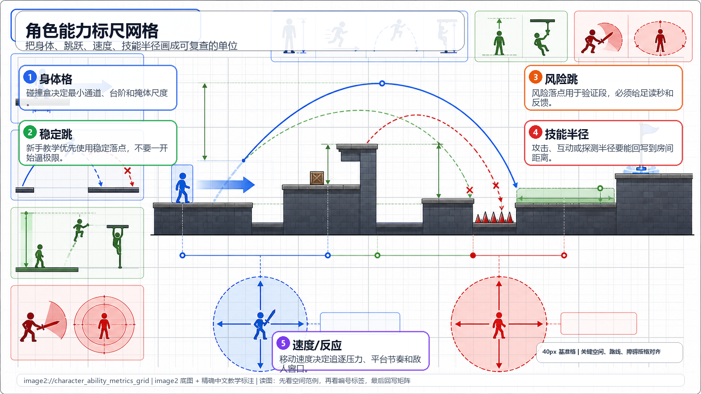

| 图像要素 | 设计说明 |
|---|---|
| 核心玩法/技能 | 用 7×13 屏幕格记录角色身体与移动能力 |
| 玩家动作/操作 | 站立、横跳、纵跳、落地、判断极限距离 |
| 障碍或敌人 | 过高平台、过宽坑洞、低矮天花板、过窄通道 |
| 奖励或资源 | 安全落点、教学金币、主路径平台、可选挑战平台 |
| 教学状态与期望情绪 | 引介；让设计师先掌握“角色能做到什么” |

这张图的重点不是展示角色“设定”，而是把玩家能做到的事情变成可画的单位：身体格、纵向可达、横向稳定跳、风险落点、移动速度和技能半径都必须能回写到关卡矩阵。

| 标尺项 | 精确定义 | 设计用途 |
|---|---|---|
| 主角 | 1×1 格碰撞盒 | 所有通道、洞口、平台宽度的基准 |
| 屏幕 | 7×13 格 | 判断一屏内能展示多少信息与挑战 |
| 移动速度 | 4 格/秒 | 估算反应时间、追逐压力和平台节奏 |
| 纵向可达 | 从站立格向上 3 格 | 决定台阶高度、攀爬教学和失败边界 |
| 横向稳定跳 | 3 格 | 用于主路径安全挑战 |
| 横向风险区 | 第 4 格为空心格 | 用于可选挑战或后期验证，不适合首次教学 |

操作建议：新手在画第一张 blockout 前，先复制这张图，把自己的角色能力填进去。不要先画“好看的房间”，先画“角色确定能通过的房间”。

### 关卡元素尺标：体量、难度、敌人、资源

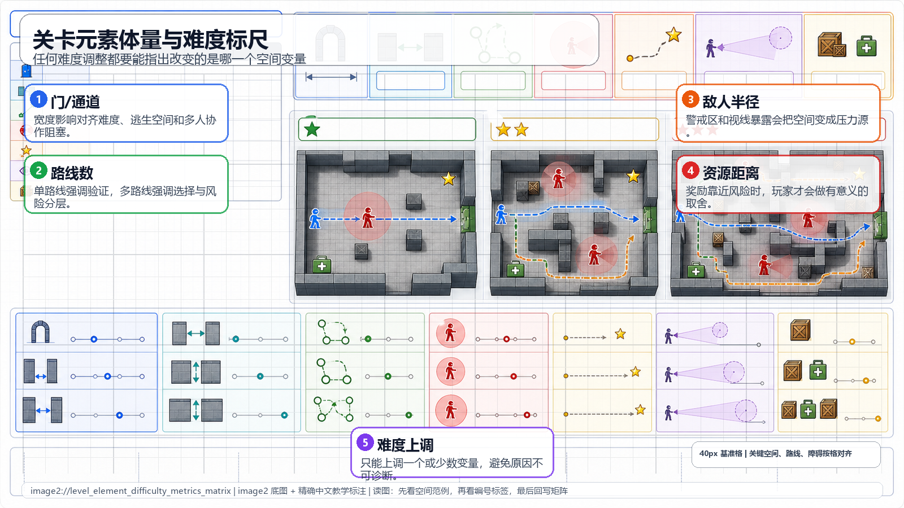

| 图像要素 | 设计说明 |
|---|---|
| 核心玩法/技能 | 用“体量 × 难度”估算关卡段落的时间、死亡率与敌人配置 |
| 玩家动作/操作 | 进入房间、选择路径、处理敌人、到达出口 |
| 障碍或敌人 | 普通敌人、精英敌人、Boss 型敌人、复合敌人组合 |
| 奖励或资源 | 房间出口、阶段奖励、补给、可选高价值目标 |
| 教学状态与期望情绪 | 规划；让设计师在放内容前先定义体量和期望强度 |

关卡元素尺标把规划矩阵和空间小图放在一起。使用时不要把数字当绝对标准，而要把它当团队共同讨论的初始假设：任何一格难度上调，都要能在房间图里指出改变的是门宽、通道、路线数、敌人半径、资源距离还是视线暴露。

| 维度 | 新手怎么填 | 常见错误 | 修正方式 |
|---|---|---|---|
| 体量 | 小型、中型、大型；对应房间数、路线数、预计时长 | 只写“大房间”，不写玩家要走多久 | 用格数、房间数、预计时间描述 |
| 难度 | 简单、中等、困难；对应死亡率或失败次数 | 把敌人多等同于困难 | 同时记录敌人、距离、视线、资源、失败代价 |
| 敌人种类 | 普通、精英、Boss、组合 | 一开始就混合太多敌人 | 先单一教学，再组合验证 |
| 房间小图 | 用路径数、敌人位置、出口距离表达 | 只画美术布局 | 先画玩家路线和信息顺序 |

### 挑战矩阵尺标：同一技能的四种变体

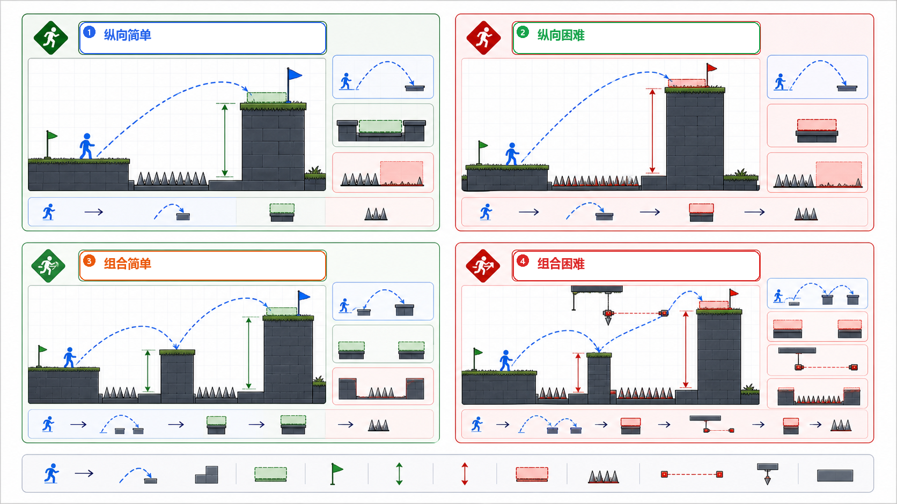

| 图像要素 | 设计说明 |
|---|---|
| 核心玩法/技能 | 把同一技能拆成简单、困难、组合、过载四种状态 |
| 玩家动作/操作 | 跳过低墙、跳上高墙、跨坑后落到平台、处理高台组合 |
| 障碍或敌人 | 1 格墙、2 格墙、1 格坑、3 格坑、2 到 3 格高台 |
| 奖励或资源 | 安全落点、主路推进、可选挑战、失败后重试空间 |
| 教学状态与期望情绪 | 变奏；让新手看到难度不是随机加码，而是矩阵化组合 |

四格挑战的读法：

| 格子 | 难度含义 | 适合放在关卡哪里 | 设计提醒 |
|---|---|---|---|
| 纵向跳跃：简单 | 低墙或低台，只验证起跳 | 引介段 | 失败代价要低 |
| 纵向跳跃：困难 | 高墙或高台，接近能力上限 | 验证段 | 必须先教过跳跃高度 |
| 组合挑战：简单 | 小坑 + 可落脚平台 | 练习段或变奏段 | 给足落点，玩家能复盘 |
| 组合挑战：困难/不完整 | 大坑 + 高台，超出稳定教学区 | 后期挑战或可选路线 | 主路径不要突然放这种组合 |

### 横向跳跃尺标：同样是坑，宽度就是教学差异

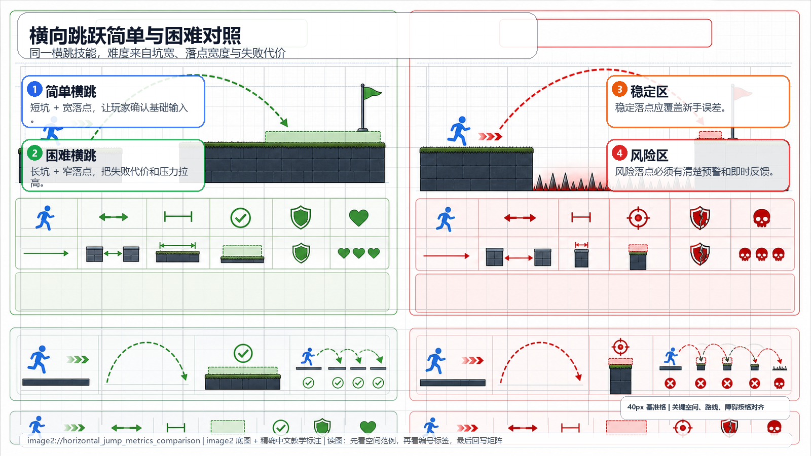

| 图像要素 | 设计说明 |
|---|---|
| 核心玩法/技能 | 对比 1 格坑与 3 格坑如何改变教学目标 |
| 玩家动作/操作 | 起跳、越过坑、落地、判断安全距离 |
| 障碍或敌人 | 1 格坑、3 格坑、落点宽度不足、起跳空间不足 |
| 奖励或资源 | 通过主路、可见落点、失败后重试平台 |
| 教学状态与期望情绪 | 对照；让新手理解“同样是坑，宽度不同就是不同教学” |

落地规则建议：

| 坑宽 | 教学状态 | 期望情绪 | 使用建议 |
|---|---|---|---|
| 1 格 | 引介 | 安全、理解 | 第一次出现，旁边不要叠加敌人 |
| 2 格 | 练习 | 专注 | 可以加入轻微时间压力 |
| 3 格 | 验证 | 紧张 | 玩家已经掌握起跳和落点后再使用 |
| 4 格或以上 | 精通/可选 | 挑战、成就感 | 主路径慎用，必须有明确预告和回收 |

### Metrics 图像重绘规范

如果后续继续用 image2 生成同类图，提示词里必须锁定这些信息：

- 白底、清晰黑色网格、无水印、无 logo。
- 所有格子等宽等高，玩家、坑、墙、平台必须贴齐格线。
- 角色能力图必须保留：主角 1×1、屏幕 7×13、移动速度 4 格/秒、纵向可达、横向稳定跳和风险格。
- 体量难度图必须保留：小/中/大体量，简单/中等/困难，敌人种类行，房间小图。
- 挑战矩阵必须保留四格：纵向简单、纵向困难、组合简单、组合困难/不完整。
- 横向跳跃图必须保留 1 格坑和 3 格坑对照。

## Gameplay Matrix 的运用

### Matrix 与 Gameplay Matrix 的差别

Matrix 是把多个维度交叉成表格；Gameplay Matrix 是把“玩家会什么、做什么、遇到什么、得到什么、感到什么”绑定到关卡进程中的表格。

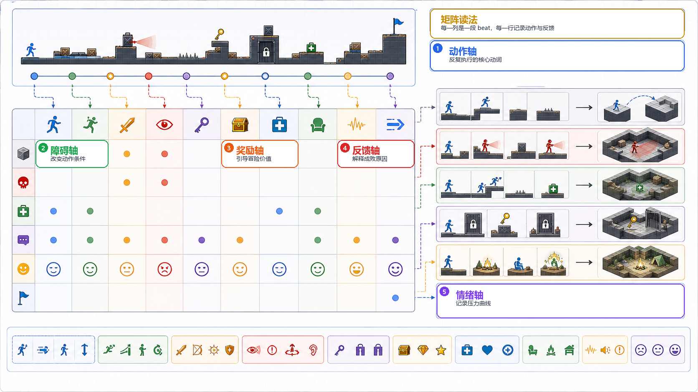

| 图像要素 | 设计说明 |
|---|---|
| 核心玩法/技能 | 用横轴表示进程，用纵轴表示设计维度 |
| 玩家动作/操作 | 每一格都写可观察动作 |
| 障碍或敌人 | 障碍必须服务当前技能，不要随意堆叠 |
| 奖励或资源 | 奖励要强化正确动作或引导路线 |
| 教学状态与期望情绪 | 让团队看到教学顺序、难度曲线和情绪曲线 |

### 每个矩阵格必须回答的问题

| 字段 | 必填问题 | 示例 |
|---|---|---|
| Beat | 这是第几个教学段落？ | B01、B02、B03 |
| 核心玩法/技能 | 玩家在这一格学什么或验证什么？ | 横向短跳、观察锁门、侧身躲避 |
| 玩家动作/操作 | 玩家具体做什么？ | 跑跳过 1 格坑、看见钥匙门、绕开敌人视线 |
| 障碍或敌人 | 什么东西迫使玩家做这个动作？ | 坑、墙、巡逻敌人、锁门、倒计时 |
| 奖励或资源 | 什么东西证明动作有效？ | 安全落点、金币、钥匙、补给、捷径 |
| 教学状态 | 引介、练习、验证、变奏、精通、释放 | B01 引介，B03 验证 |
| 期望情绪 | 玩家应感到什么？ | 好奇、理解、专注、紧张、释然 |
| 空间说明 | 这个格子在地图上怎么体现？ | 低风险平台、宽落点、可见出口 |
| 测试假设 | 你希望玩家如何表现？ | 80% 玩家第一次能通过 |

### 教学状态字典

| 状态 | 目的 | 空间特征 | 常见错误 |
|---|---|---|---|
| 引介 | 第一次展示技能 | 安全、单一、可见、低惩罚 | 一出现就叠敌人和时间压力 |
| 练习 | 让玩家重复成功 | 变化小，反馈明确 | 重复太久，没有新信息 |
| 验证 | 确认玩家真的学会 | 加入风险或失败代价 | 没教过就考试 |
| 变奏 | 改变上下文 | 同技能，不同空间或敌人 | 变奏成新技能 |
| 精通 | 组合多个已学技能 | 高压但可读 | 只靠反应，不可复盘 |
| 释放 | 让玩家整理体验 | 低压、补给、出口、展示成果 | 峰值后马上进入新高压 |

## 教学矩阵示例

下面的例子不是让你照抄，而是展示矩阵如何和空间同步。每个例子都可以替换成你项目里的角色能力、敌人和资源。

### 示例 1：平台动作基础跳跃五段式

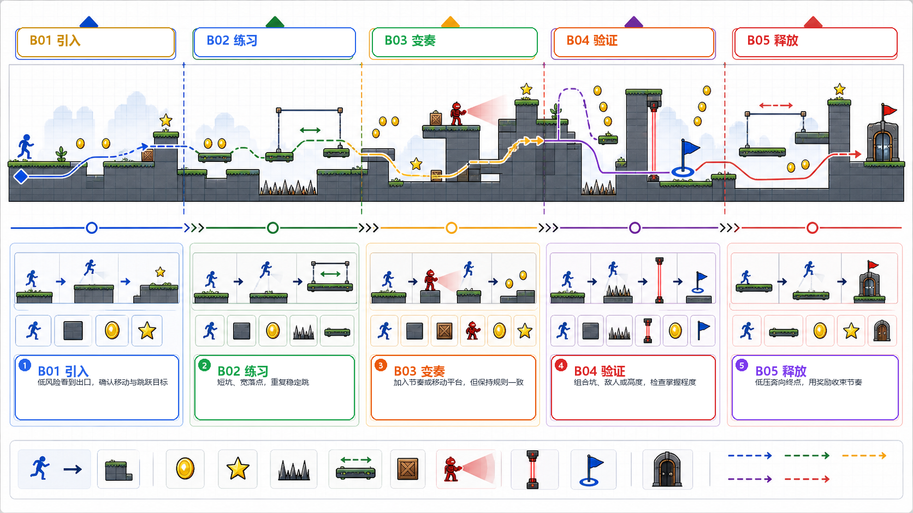

| 图像要素 | 设计说明 |
|---|---|
| 核心玩法/技能 | 从低风险移动过渡到跳跃验证 |
| 玩家动作/操作 | 跑、跳、落地、二次尝试 |
| 障碍或敌人 | 低墙、1 格坑、移动障碍、组合平台 |
| 奖励或资源 | 路线金币、安全落点、终点奖励 |
| 教学状态与期望情绪 | 引介到释放；让玩家逐步建立掌控感 |

| Beat | 核心玩法/技能 | 玩家动作/操作 | 障碍或敌人 | 奖励或资源 | 教学状态 | 期望情绪 | 空间说明 |
|---|---|---|---|---|---|---|---|
| B01 | 基础移动 | 跑到可见目标 | 平地与低台 | 路线金币 | 引介 | 好奇 | 宽平台，无失败惩罚 |
| B02 | 1 格短跳 | 跳过小坑 | 1 格坑 | 安全落点 | 引介 | 理解 | 坑前后都给站立空间 |
| B03 | 连续短跳 | 控制起跳节奏 | 两个 1 格坑 | 金币线 | 练习 | 专注 | 坑之间间距固定 |
| B04 | 3 格验证跳 | 助跑后跳过宽坑 | 3 格坑 | 过关路径 | 验证 | 紧张 | 只验证跳距，不叠敌人 |
| B05 | 释放段 | 轻松跑向出口 | 低压障碍 | 终点奖励 | 释放 | 释然 | 给玩家整理节奏 |

#### 同步空间草图

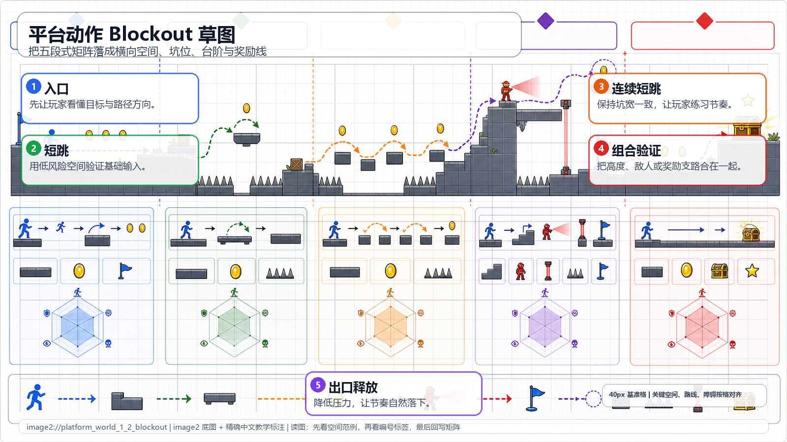

| 图像要素 | 设计说明 |
|---|---|
| 核心玩法/技能 | 把五段式矩阵落到横向空间 |
| 玩家动作/操作 | 依次经历移动、短跳、连续跳、验证跳、出口 |
| 障碍或敌人 | 坑宽逐步增加，组合度逐步提高 |
| 奖励或资源 | 金币线和出口提示玩家正确路线 |
| 教学状态与期望情绪 | 矩阵与空间同步；让读者看到每个 beat 的位置 |

### 示例 2：解谜关卡的“观察 -> 操作 -> 反馈”矩阵

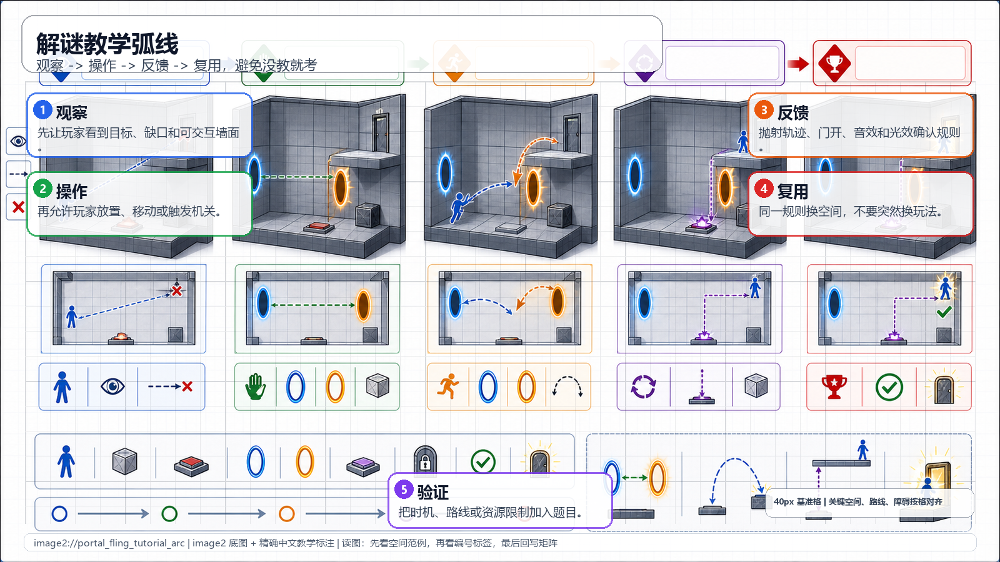

| 图像要素 | 设计说明 |
|---|---|
| 核心玩法/技能 | 先观察规则，再操作机关，再利用反馈推进 |
| 玩家动作/操作 | 看目标、触发机关、比较变化、再次操作 |
| 障碍或敌人 | 信息遮挡、单向门、时序机关、错误路径 |
| 奖励或资源 | 开门、桥梁、可见出口、捷径 |
| 教学状态与期望情绪 | 从困惑到理解；让玩家觉得“我想通了” |

| Beat | 核心玩法/技能 | 玩家动作/操作 | 障碍或敌人 | 奖励或资源 | 教学状态 | 期望情绪 | 空间说明 |
|---|---|---|---|---|---|---|---|
| B01 | 观察目标 | 看见出口但无法到达 | 透明墙/高台 | 目标预告 | 引介 | 好奇 | 出口先可见 |
| B02 | 操作机关 | 按下开关 | 单一开关 | 门短暂开启 | 引介 | 理解 | 机关与门在同一视线内 |
| B03 | 反馈比较 | 观察门开关状态 | 计时限制 | 安全重试 | 练习 | 专注 | 失败不惩罚，只重置 |
| B04 | 规则迁移 | 在新位置复用机关 | 转角或遮挡 | 新路线 | 验证 | 成就 | 同规则，不同空间 |
| B05 | 释放 | 走到出口 | 无 | 出口奖励 | 释放 | 释然 | 展示玩家已经掌握规则 |

#### 同步空间草图

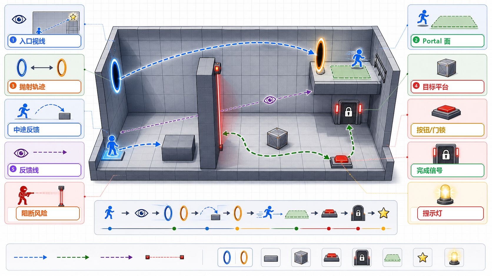

| 图像要素 | 设计说明 |
|---|---|
| 核心玩法/技能 | 将观察、机关、反馈和出口放到同一空间关系中 |
| 玩家动作/操作 | 进入房间、看出口、按机关、返回观察、通过 |
| 障碍或敌人 | 阻断路径、时序门、视线遮挡 |
| 奖励或资源 | 可见出口、开启路径、成功反馈 |
| 教学状态与期望情绪 | 空间推理；让玩家通过布局理解规则 |

### 示例 3：射击遭遇的节奏矩阵

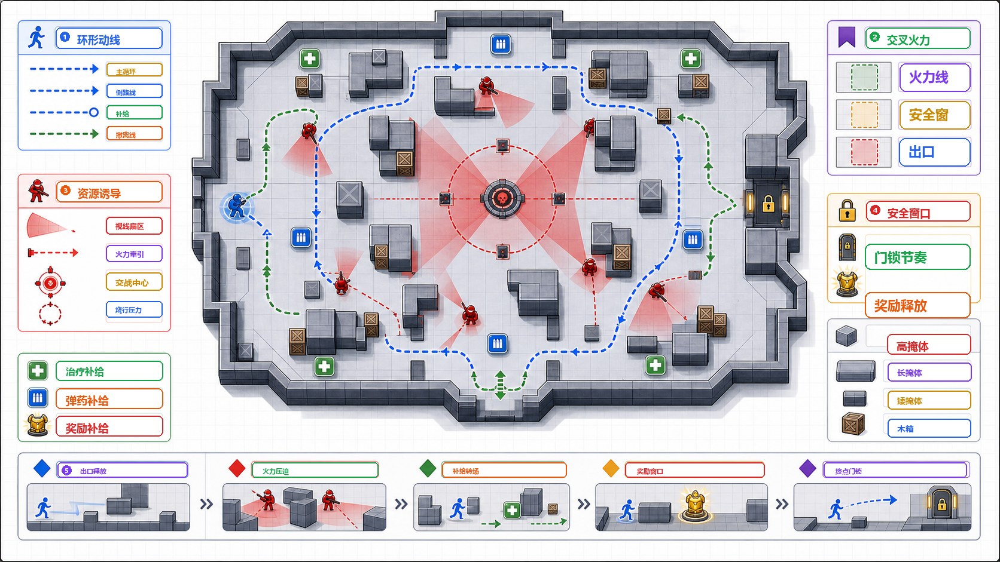

| 图像要素 | 设计说明 |
|---|---|
| 核心玩法/技能 | 移动射击、换位、优先级判断 |
| 玩家动作/操作 | 进入、找掩体、清小怪、处理精英、补给、退出 |
| 障碍或敌人 | 近战敌人、远程敌人、侧翼路线、资源压力 |
| 奖励或资源 | 弹药、生命、临时安全区、出口 |
| 教学状态与期望情绪 | 高压验证；让压力可读、可复盘 |

| Beat | 核心玩法/技能 | 玩家动作/操作 | 障碍或敌人 | 奖励或资源 | 教学状态 | 期望情绪 | 空间说明 |
|---|---|---|---|---|---|---|---|
| B01 | 入口读场 | 进入后快速观察 | 少量低威胁敌人 | 弹药提示 | 引介 | 警觉 | 第一眼看见掩体与出口方向 |
| B02 | 移动射击 | 边移动边攻击 | 近战敌人逼近 | 生命补给 | 练习 | 专注 | 中央空间允许绕圈 |
| B03 | 优先级判断 | 先处理高威胁目标 | 远程敌人占高点 | 高点路线 | 验证 | 紧张 | 高威胁敌人必须可读 |
| B04 | 资源压力 | 冒险拿补给 | 侧翼敌人 | 弹药/生命 | 变奏 | 贪心与警觉 | 补给点不能无脑安全 |
| B05 | 清场释放 | 检查剩余敌人与出口 | 零星敌人 | 出口 | 释放 | 释然 | 节奏落下，允许复盘 |

### 示例 4：合作与多角色矩阵

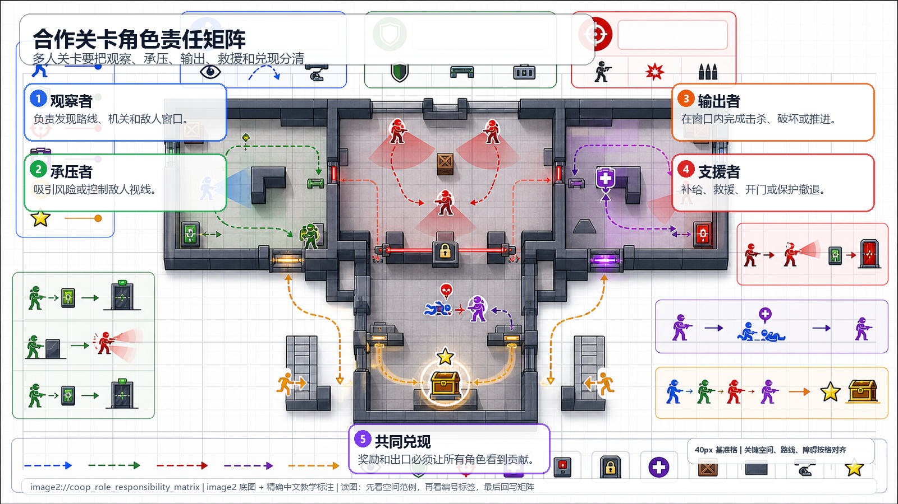

| 图像要素 | 设计说明 |
|---|---|
| 核心玩法/技能 | 把角色能力、责任和同步点写清楚 |
| 玩家动作/操作 | 呼叫、确认、分工、同步执行 |
| 障碍或敌人 | 信息不对称、时间限制、双人开关、分离路线 |
| 奖励或资源 | 共享捷径、双人门、团队进展 |
| 教学状态与期望情绪 | 信任；让合作不是两个单人关卡并排 |

| Beat | 核心玩法/技能 | 玩家动作/操作 | 障碍或敌人 | 奖励或资源 | 教学状态 | 期望情绪 | 空间说明 |
|---|---|---|---|---|---|---|---|
| B01 | 角色识别 | 各自使用一次能力 | 单人可解的小阻碍 | 共享路径 | 引介 | 清楚 | 两名玩家都能看见结果 |
| B02 | 信息沟通 | 一人观察，一人执行 | 信息不对称 | 安全通过 | 练习 | 信任 | 观察者视角必须有用 |
| B03 | 同步执行 | 倒数后同时操作 | 双开关 | 开门 | 验证 | 紧张 | 失败只重置，不长时间惩罚 |
| B04 | 角色变奏 | 交换主导权 | 分离路线 | 捷径 | 变奏 | 新鲜 | 不让一个玩家长期无事可做 |
| B05 | 共同释放 | 汇合到出口 | 无 | 共享奖励 | 释放 | 释然 | 汇合点展示双方贡献 |

## 流程与迭代

### 概念 -> 进程 -> 空间 -> 测试 -> 迭代

关卡设计不是一次写完，而是一轮轮把假设变成体验。

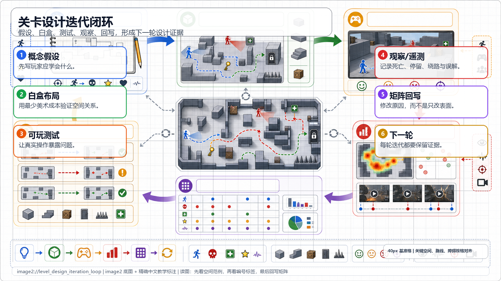

| 图像要素 | 设计说明 |
|---|---|
| 核心玩法/技能 | 从概念到矩阵，再到空间、测试和回写 |
| 玩家动作/操作 | 设计师填写、搭建、观察、修改 |
| 障碍或敌人 | 假设不清、空间不支持、测试证据不足 |
| 奖励或资源 | 可复用流程、明确修正方向 |
| 教学状态与期望情绪 | 方法论；让新手知道每一步产出什么 |

| 阶段 | 关键问题 | 产出物 | 常见检查 |
|---|---|---|---|
| 概念 | 这关教什么？ | 一句话目标、核心动词 | 是否只有一个主技能？ |
| 进程 | 先教什么，后考什么？ | Gameplay Matrix | 是否存在没教就考？ |
| 空间 | 这个技能在哪里发生？ | Blockout | 是否能从入口读到目标？ |
| 测试 | 玩家是否按预期行动？ | 观察记录、数据、访谈 | 失败是否可复盘？ |
| 迭代 | 改矩阵、空间、敌人还是奖励？ | 修订版矩阵和灰盒 | 是否只改了表象，没有改原因？ |

### 从矩阵到 Blockout

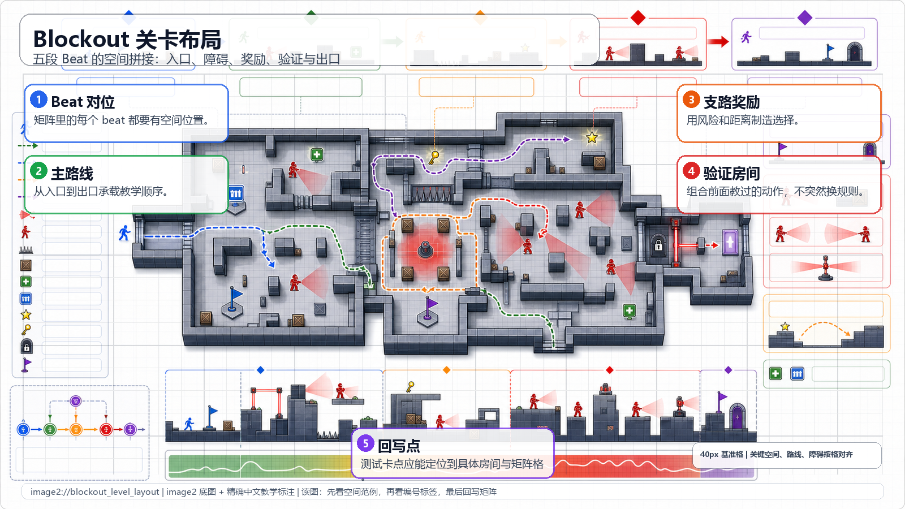

| 图像要素 | 设计说明 |
|---|---|
| 核心玩法/技能 | 把矩阵的 beat 转成空间节点 |
| 玩家动作/操作 | 入口观察、主路推进、支路选择、验证、出口释放 |
| 障碍或敌人 | 锁门、坑、敌人、视线遮挡、分岔 |
| 奖励或资源 | 主路奖励、支路奖励、补给、捷径 |
| 教学状态与期望情绪 | 实作；让设计师从表格进入空间 |

Blockout 检查清单：

| 检查项 | 通过标准 |
|---|---|
| 入口是否能读到目标 | 玩家进入 3 秒内能理解前进方向或短期目标 |
| 每个 beat 是否有空间位置 | 矩阵里没有“悬空”的格子 |
| 障碍是否服务当前技能 | 不把多个新技能堆在同一格 |
| 奖励是否强化正确动作 | 奖励位置指向目标行为，而不是误导玩家 |
| 失败后是否能复盘 | 玩家知道自己哪里错，而不是觉得被坑 |

## 量化与回写

### 设计假设如何变成验证指标

矩阵不是写完就结束。每一格都应该能转成一个测试假设。

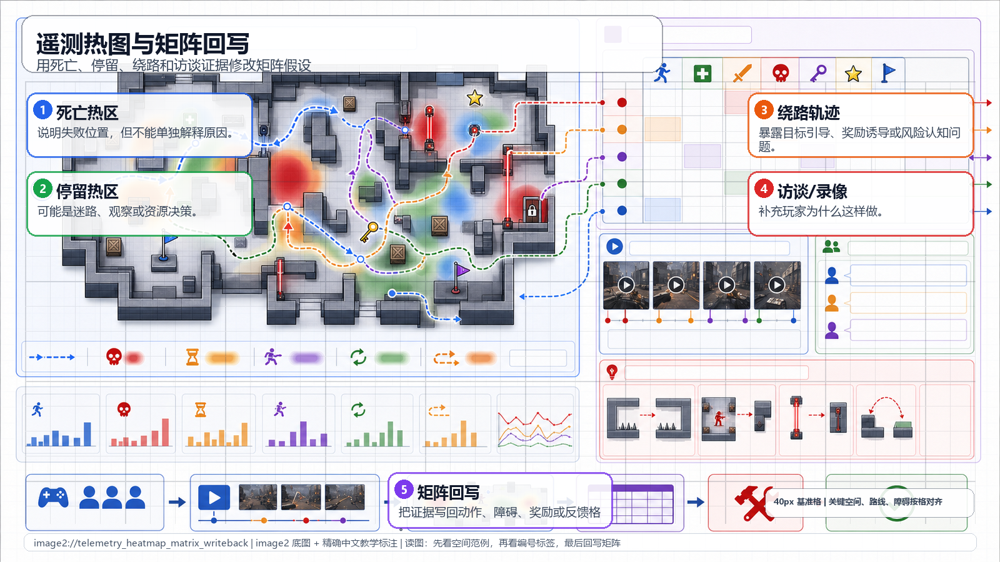

| 图像要素 | 设计说明 |
|---|---|
| 核心玩法/技能 | 把测试证据写回矩阵格 |
| 玩家动作/操作 | 死亡、停留、重复失败、绕路、放弃、成功 |
| 障碍或敌人 | 尺寸过难、目标不可读、敌人压迫过强、奖励误导 |
| 奖励或资源 | 数据、观察、访谈、修正动作 |
| 教学状态与期望情绪 | 验证；让设计从“我觉得”变成“证据显示” |

| 矩阵格 | 设计假设 | 观察/数据 | 访谈问题 | 回写动作 |
|---|---|---|---|---|
| B02：1 格短跳 | 80% 新玩家第一次能通过 | 首次成功率、停顿时间 | “你知道要跳过去吗？” | 如果看不懂，加金币线或镜头提示 |
| B04：3 格验证跳 | 玩家已经掌握助跑起跳 | 死亡次数、起跳位置分布 | “失败时你觉得原因是什么？” | 如果知道但做不到，放宽落点；如果不知道，回到教学 |
| 解谜 B03：机关反馈 | 玩家能理解按钮影响门 | 回头观察率、重复尝试次数 | “你觉得按钮改变了什么？” | 如果没看到反馈，调整视线和音效 |
| 射击 B03：高威胁目标 | 玩家能识别优先目标 | 伤害来源、击杀顺序 | “你最先注意到哪个敌人？” | 如果不可读，改变敌人位置或入场提示 |

### 数据、访谈与观察的分工

| 方法 | 能回答什么 | 不能回答什么 | 最适合回写到哪里 |
|---|---|---|---|
| 遥测数据 | 哪里死、哪里停、哪里绕路 | 玩家为什么这样做 | 难度、空间、资源位置 |
| 现场观察 | 玩家看哪里、犹豫多久、先做什么 | 玩家内心解释 | 玩家动作、目标可读性 |
| 访谈 | 玩家如何理解失败和目标 | 大样本趋势 | 情绪、误解原因、提示清晰度 |
| 录像复盘 | 行为顺序与失败前动作 | 大量统计 | 节奏、空间读法、教学状态 |

### 回写原则

| 发现 | 不要急着做 | 先问 | 可能修正 |
|---|---|---|---|
| 死亡率高 | 直接削弱所有障碍 | 是不会做，还是没看懂？ | 放宽标尺、补教学、调整入口视线 |
| 玩家绕路 | 关掉支路 | 支路是否比主路更可读？ | 强化主路目标，降低误导奖励 |
| 玩家没拿奖励 | 提高奖励数值 | 玩家是否看见奖励，是否理解价值？ | 改位置、改对比、改反馈 |
| 玩家说“不公平” | 只降低难度 | 失败是否可复盘？ | 提前预告、降低隐性惩罚、增加重试空间 |

## 可扩展到不同类型游戏

矩阵方法不是某一种类型专用。不同类型只是替换核心动词、标尺单位、障碍形式和验证指标。

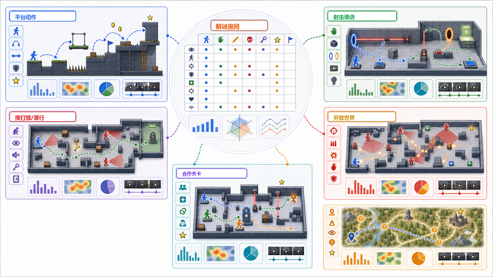

| 图像要素 | 设计说明 |
|---|---|
| 核心玩法/技能 | 同一矩阵方法适配不同类型 |
| 玩家动作/操作 | 根据类型替换为跳跃、推理、瞄准、潜行、协作 |
| 障碍或敌人 | 根据类型替换为坑、锁、敌人、视线、时间限制 |
| 奖励或资源 | 金币、钥匙、弹药、信息、剧情推进、捷径 |
| 教学状态与期望情绪 | 可扩展；让团队用同一语言讨论不同关卡 |

| 类型 | 核心技能轴 | 常用标尺 | 常见陷阱 |
|---|---|---|---|
| 平台动作 | 跳跃、落点、节奏 | 格子、角色宽度、跳距 | 坑宽过早接近上限 |
| 解谜 | 规则理解、因果反馈 | 房间模块、视线、交互距离 | 玩家看不到反馈 |
| 射击 | 瞄准、移动、优先级 | 视线长度、掩体间距、敌人射程 | 高威胁敌人不可读 |
| 潜行 | 观察、绕行、时机 | 视锥、巡逻周期、掩体距离 | 失败原因不可见 |
| 合作 | 分工、沟通、同步 | 玩家距离、视线共享、倒计时 | 一名玩家长期无事可做 |
| 多角色 | 能力切换、互补解法 | 角色能力范围、切换成本 | 角色能力没有独特用途 |

## 常见设计陷阱与修正策略

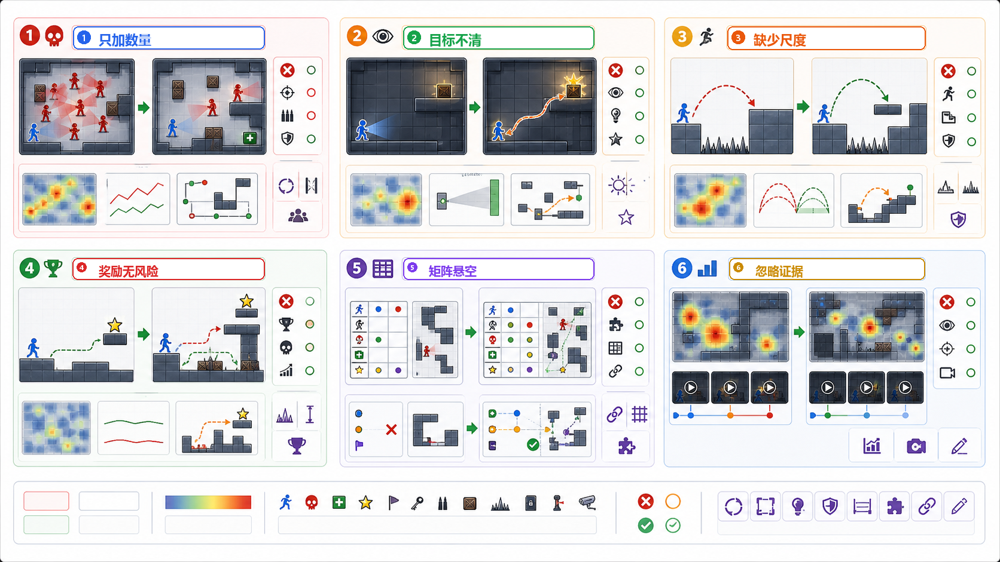

| 图像要素 | 设计说明 |
|---|---|
| 核心玩法/技能 | 识别矩阵、空间和测试中的常见问题 |
| 玩家动作/操作 | 误读、停顿、重复失败、跳过内容 |
| 障碍或敌人 | 教学缺口、难度突变、目标不可读、资源误导 |
| 奖励或资源 | 修正策略、验证指标、复测结果 |
| 教学状态与期望情绪 | 复盘；让新手知道问题通常怎么修 |

| 陷阱 | 表现 | 根因 | 修正策略 |
|---|---|---|---|
| 没教就考 | 玩家第一次见机制就死亡 | 教学状态缺失 | 增加低压引介格 |
| 只加数量不加设计 | 敌人更多但体验更乱 | 难度维度单一 | 改敌人位置、视线、节奏和资源 |
| 标尺漂移 | 同样的跳跃有时能过有时不能 | 坑宽、墙高、碰撞盒没统一 | 回到 Metrics 图，用格数重画 |
| 奖励误导 | 玩家总走错路 | 奖励位置比目标更醒目 | 调整奖励层级和视线优先级 |
| 情绪断裂 | 高压后马上又高压 | 缺少释放段 | 加低压空间、补给或展示成果 |
| 只看数据不看录像 | 知道哪里失败，不知道为什么 | 缺少行为上下文 | 绑定数据、观察和访谈 |
| 把矩阵当真理 | 表格整齐但关卡不好玩 | 工具替代体验判断 | 让矩阵记录证据，不替代试玩 |

## 团队协作 CSV 模板

配套 CSV 文件位于：

`关卡设计矩阵模板.csv`

建议把它导入 Excel、Google Sheets、Airtable 或项目管理工具。字段含义如下：

| 字段 | 用途 |
|---|---|
| Record_Type | `Progression` 表示设计进程格，`Validation` 表示测试回写格 |
| Level_ID | 关卡或房间编号 |
| Beat_ID | 节点编号，必须能对应到 blockout |
| Diagram_ID | 对应本地示意图 slug |
| Core_Play_Skill | 核心玩法/技能 |
| Player_Action | 玩家动作/操作 |
| Enemy_Obstacle | 障碍或敌人 |
| Reward_Resource | 奖励或资源 |
| Teaching_State | 引介、练习、验证、变奏、精通、释放 |
| Expected_Emotion | 期望情绪 |
| Space_Note | 空间说明，例如视线、落点、掩体、入口 |
| Hypothesis | 设计假设 |
| Metric | 验证指标 |
| Target | 目标值 |
| Observed | 实测值 |
| Player_Quote | 访谈或观察摘录 |
| Revision_Action | 回写后的修正动作 |
| Owner | 负责人 |
| Status | Open、Testing、Fixed、Verified |

### CSV 示例片段

```csv
Record_Type,Level_ID,Beat_ID,Diagram_ID,Core_Play_Skill,Player_Action,Enemy_Obstacle,Reward_Resource,Teaching_State,Expected_Emotion,Space_Note,Hypothesis,Metric,Target,Observed,Player_Quote,Revision_Action,Owner,Status
Progression,L01,B01,character_ability_metrics_grid,Body Metrics,Stand+Move,LowCeiling+NarrowPassage,ReadableCollision,Introduce,Clarity,1x1 body grid,Designers can size passages from body metrics,Collision_Confusion_Count,0,,,"",LD,Open
Progression,L01,B02,horizontal_jump_metrics_comparison,One Tile Gap,Run+Jump+Land,OneGridGap,MainPathProgress,Introduce,Confidence,Safe landing before and after gap,New players can pass the first gap,First_Try_SuccessRate,>=85%,,,"",LD,Open
Validation,L01,B04,horizontal_jump_metrics_comparison,Three Tile Gap,Run+Jump+Land,ThreeGridGap,NextRoomAccess,Validate,Tension,Wide gap after short jump practice,Players understand the gap but must execute cleanly,Deaths_Before_Success,<=3,6,"我知道要跳，但落点太窄",Widen first landing and move challenge to later beat,LD,Testing
```

## 实务练习

### 练习 1：把一个房间改写成矩阵

选一个你熟悉的关卡房间，先不要画地图，只填写五个 beat：

| Beat | 核心玩法/技能 | 玩家动作/操作 | 障碍或敌人 | 奖励或资源 | 教学状态 | 期望情绪 |
|---|---|---|---|---|---|---|
| B01 |  |  |  |  | 引介 |  |
| B02 |  |  |  |  | 练习 |  |
| B03 |  |  |  |  | 验证 |  |
| B04 |  |  |  |  | 变奏 |  |
| B05 |  |  |  |  | 释放 |  |

检查三件事：是否有 beat 在测试玩家没学过的技能？是否有 beat 只有奖励但没有动作？是否有 beat 没有情绪目标？

### 练习 2：把矩阵落成 blockout

把练习 1 的五个 beat 标到灰盒图上。每个 beat 至少标注入口、出口、第一眼目标、障碍位置、奖励位置和失败回收路线。

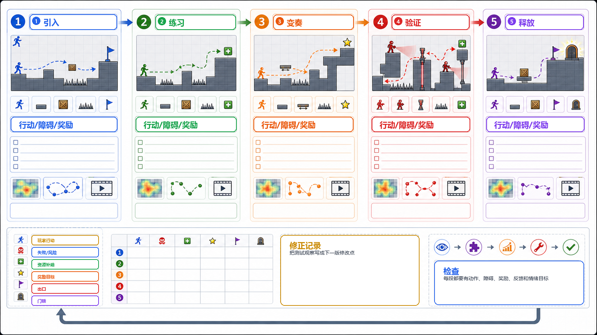

| 图像要素 | 设计说明 |
|---|---|
| 核心玩法/技能 | 将五段式矩阵转为空间草图 |
| 玩家动作/操作 | 从入口依次经历引介、练习、验证、变奏、释放 |
| 障碍或敌人 | 每段只承担一个主要教学功能 |
| 奖励或资源 | 用奖励强化正确路线和正确动作 |
| 教学状态与期望情绪 | 让设计师练习矩阵与空间同步展示 |

### 练习 3：写一条测试回写

选择矩阵中风险最高的一格，写出：

- 设计假设：玩家应该如何理解这里？
- 观察点：测试时看什么行为？
- 指标：记录什么数值？
- 访谈：问玩家什么？
- 回写：如果不符合预期，先改矩阵、空间、敌人还是奖励？

## 结语

关卡设计工具的价值在于让团队能清楚地讨论体验：玩家要学什么，在哪里学，怎么验证，如何修正。

当 Metrics 定义了尺度，Gameplay Matrix 定义了教学顺序，Blockout 承载了空间关系，测试回写提供了证据，关卡设计就不再只是“凭感觉摆内容”，而是变成一套可以训练、复盘和迭代的专业方法。

## 资料与图像说明

本教材是一份方法论教材，重点来自关卡设计流程、灰盒评审、试玩观察和团队协作经验，不把某一款游戏截图当作唯一证据。

正文中的图片全部使用本地可预览资产。它们的作用是帮助读者理解矩阵、标尺、blockout 和测试回写之间的关系，不要求读者把底图当作精密工程图。涉及格距、跳距、墙高、房间体量、敌人半径或技能范围时，以正文指标、图中标注和 40px 基准格为准。

本仓库附带 `关卡设计矩阵模板.csv`，读者可以按自己的项目替换核心技能、障碍、奖励、空间说明和测试指标。
